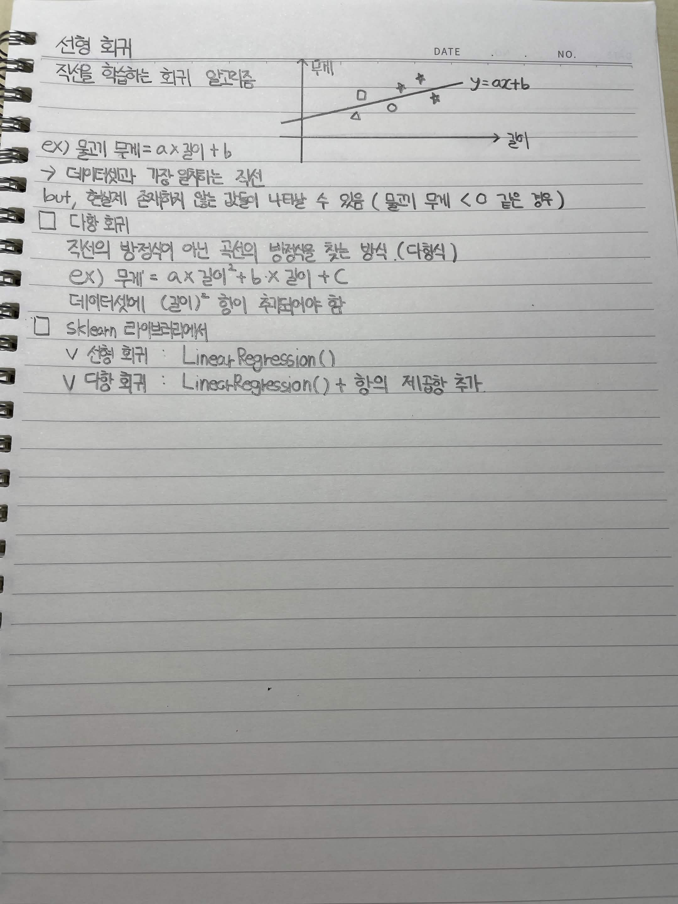

# 선형 회귀

적은 데이터를 학습하는 회귀 알고리즘

**EX) 물고기 무게 = a × 길이 + b**

→ 데이터셋과 가장 알맞는 직선을 찾음

단, 현실에 존재하지 않는 값이 나타날 수 있음 (물고기 무게 < 0 같은 경우)

## 다항 회귀

직선의 방정식이 아닌 곡선의 방정식을 찾는 방식 (다항식)

**EX) 무게 = a × 길이² + b × 길이 + c**

데이터셋에 (길이)² 항이 추가되어야 함

## sklearn 라이브러리에서

* 선형 회귀 : `LinearRegression()`
* 다항 회귀 : `LinearRegression()` + 항의 제곱항 추가

