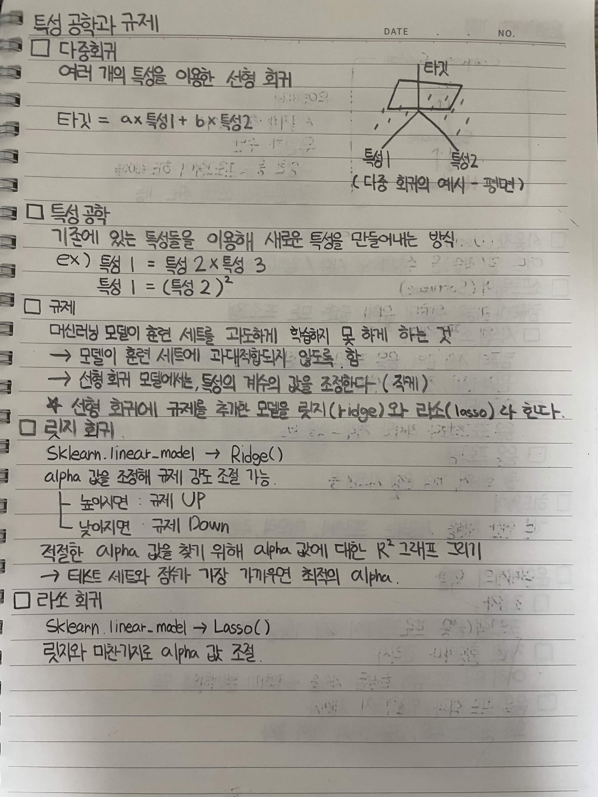

# 특성 공학과 규제

## 다중회귀

여러 개의 특성을 이용한 선형 회귀

타깃 = a x 특성1 + b x 특성2

다중 회귀의 예시 - 평면

## 특성 공학

기존에 있는 특성들을 이용해 새로운 특성을 만들어내는 방식

ex)

특성1 = 특성2 x 특성3

특성1 = (특성2)^2

## 규제

머신러닝 모델이 훈련 세트를 과도하게 학습하지 못 하게 하는 것

모델이 훈련 세트에 과대적합되지 않도록 함

선형 회귀 모델에서는 특성의 계수의 값을 조절한다

선형 회귀에 규제를 추가한 모델을 릿지(Ridge)와 라쏘(Lasso)라 한다

## 릿지 회귀

sklearn.linear_model -> Ridge()

alpha 값을 조정해 규제 강도 조절 가능

높이면 규제 UP

낮추면 규제 DOWN

적절한 alpha 값을 찾기 위해 alpha 값에 대한 R^2 그래프 그리기

테스트 세트와 점수가 가장 가까우면 최적의 alpha

## 라쏘 회귀

sklearn.linear_model -> Lasso()

릿지와 마찬가지로 alpha 값 조절

