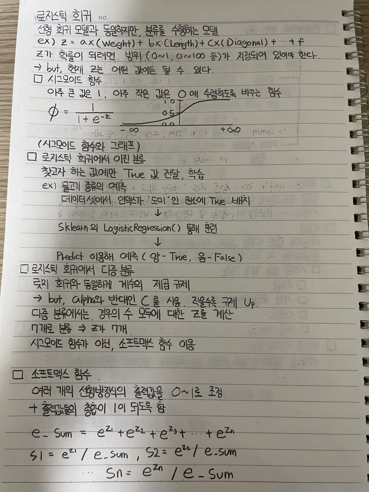

# 로지스틱 회귀

선형 회귀 모델과 동일하지만, 분류를 수행하는 모델

예)

`z = a × Weight + b × Length + c × Diagonal + ... + f`

z가 확률이 되려면 범위(0~1, 0~100 등)가 지정되어 있어야 한다.

하지만 현재 z는 어떤 값이든 될 수 있다.

## 시그모이드 함수

아주 큰 값은 1, 아주 작은 값은 0에 수렴하도록 바꾸는 함수

`φ = 1 / (1 + e^(-z))`

(시그모이드 함수 그래프)

## 로지스틱 회귀에서 이진 분류

찾고자 하는 값에만 `True` 값을 전달하여 학습

예) 물고기 종류 예측

데이터셋에서 인덱스가 '도미'인 원소에 `True` 배치

↓

`sklearn`의 `LogisticRegression()`으로 훈련

↓

`predict()`를 이용해 예측

* 양성 → `True`
* 음성 → `False`

## 로지스틱 회귀에서 다중 분류

로지스틱 회귀와 동일하게 계수의 제곱 규제 사용

하지만 `alpha`와 반대 개념인 `C`를 사용하며, 값이 작을수록 규제가 강해진다.

다중 분류에서는 모든 경우에 대한 z 값을 계산한다.

예) 7개 분류 → z가 7개 생성

시그모이드 함수 대신 소프트맥스 함수를 사용한다.

## 소프트맥스 함수

여러 개의 선형 방정식 출력값을 0~1 범위로 조정하고, 출력값들의 합이 1이 되도록 하는 함수

`e_sum = e^(z1) + e^(z2) + e^(z3) + ... + e^(zn)`

`S1 = e^(z1) / e_sum`

`S2 = e^(z2) / e_sum`

`...`

`Sn = e^(zn) / e_sum`

