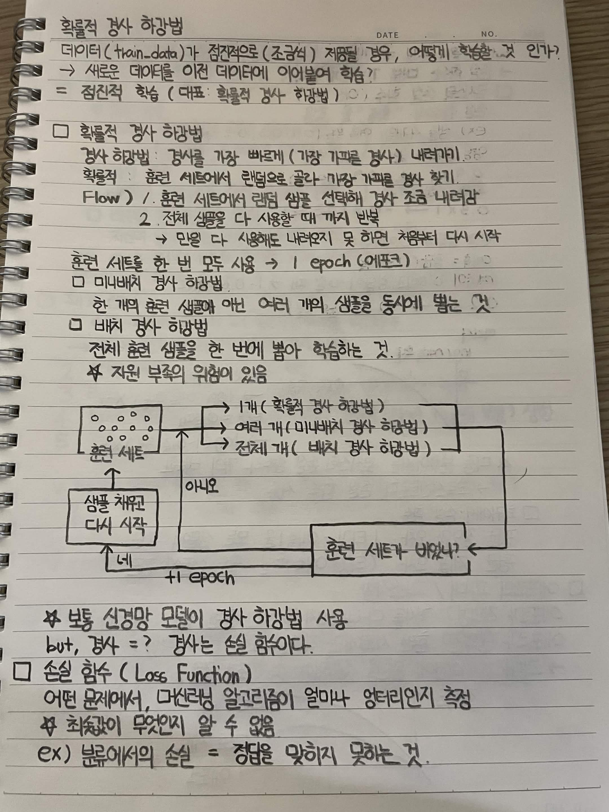
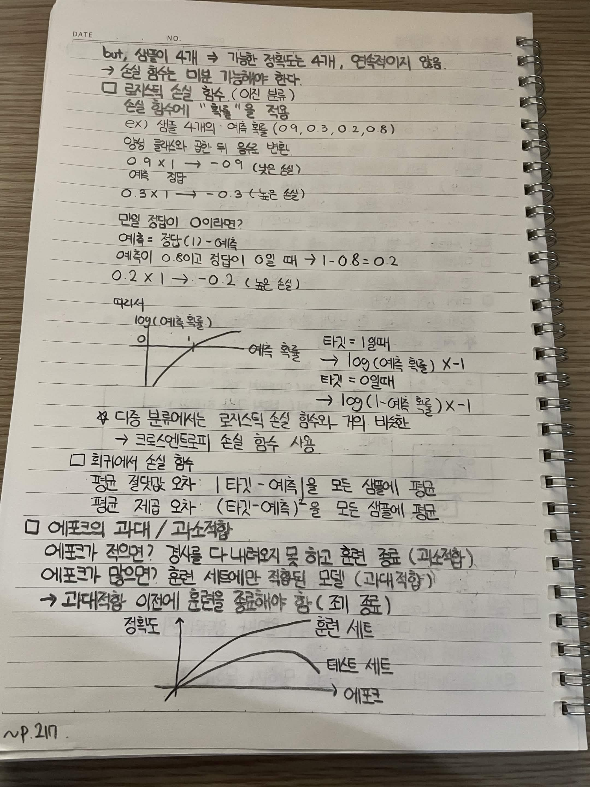

# 확률적 경사 하강법

데이터가 점진적으로 조정될 경우 어떻게 학습할 것인가

→ 새로운 데이터를 이전 데이터에 이어붙여 학습

= 점진적 학습

대표적으로 확률적 경사 하강법 사용

## 확률적 경사 하강법

경사 하강법: 경사를 가장 빠르게 내려가기

확률적: 훈련 세트에서 랜덤으로 골라 가장 가파른 경사를 찾기

### Flow

1. 훈련 세트에서 랜덤 샘플을 선택해 경사 조금 내려감
2. 전체 샘플을 다 사용할 때까지 계속 반복
   → 원일 다 사용해도 내려오지 못하면 처음부터 다시 시작

훈련 세트를 한 번 모두 사용 → **1 epoch**

## 미니배치 경사 하강법

한 개의 훈련 샘플이 아닌 여러 개의 샘플을 동시에 뽑는 것

## 배치 경사 하강법

전체 훈련 샘플을 한 번에 뽑아 학습하는 것

자원 부족의 위험이 있음

### 경사 하강법 종류

* 1개 → 확률적 경사 하강법
* 여러 개 → 미니배치 경사 하강법
* 전체 개 → 배치 경사 하강법

### 학습 과정

훈련 세트가 바닥인가?

아니오 → 경사 하강법 진행

네 → 샘플 채우고 다시 시작

+1 epoch

## 손실 함수

보통 신경망 모델이 경사 하강법 사용

but, 경사 = 경사 함수

### 손실 함수

어떤 문제에서 머신러닝 알고리즘이 얼마나 엉터리인지 측정

최솟값이 무엇인지 알 수 없음

예를 들어 분류에서의 손실 = 정답을 맞히지 못하는 것

하지만 샘플이 4개라면 가능한 정답도 4개이고 연속적이지 않음

→ 손실 함수는 미분 가능해야 한다.

## 로지스틱 손실 함수

이진 분류

손실 함수에 **확률**을 적용

예를 들어 샘플 4개의 예측 확률

`0.9, 0.3, 0.2, 0.8`

양성 클래스와 곱한 뒤 음수로 변환

`0.9 × 1 → -0.9`

낮은 손실

`0.3 × 1 → -0.3`

높은 손실

만일 정답이 0이라면

예측 = 정답 - 예측

예측이 0.8이고 정답이 0일 때

`1 - 0.8 = 0.2`

`0.2 × 1 → -0.2`

높은 손실

### 로그 적용

예측 확률에 로그를 취함

정답 = 1일 때

`log(예측 확률) × -1`

정답 = 0일 때

`log(1 - 예측 확률) × -1`

다중 분류에서는 로지스틱 손실 함수와 거의 비슷함

→ **크로스엔트로피 손실 함수** 사용

## 회귀에서 손실 함수

### 평균 절댓값 오차

`|타깃 - 예측|`을 모든 샘플에 대해 평균

### 평균 제곱 오차

`(타깃 - 예측)²`을 모든 샘플에 대해 평균

## 에포크의 과대 적합과 과소 적합

### 에포크가 적으면

정답을 다 내려가지 못하고 훈련 종료

→ **과소적합**

### 에포크가 많으면

훈련 세트에만 적합된 모델

→ **과대적합**

과대적합이 발생하기 전에 훈련을 종료해야 함

→ **조기 종료**

### 정확도 그래프

훈련 세트의 정확도는 계속 증가

테스트 세트의 정확도는 증가하다가 다시 감소

에포크가 너무 많으면 과대적합 발생

