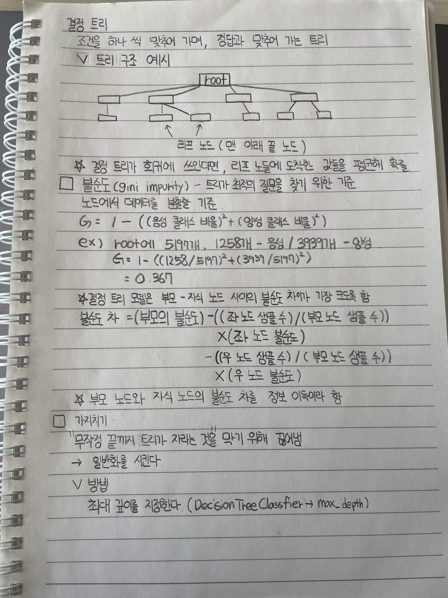

# 결정 트리

조건을 하나씩 맞춰가며, 정답과 맞춰 가는 트리

## 트리 구조 예시

```text
                    root
              /      |      |      \
             □       □      □       □
            /       / \      \      / \
           □       □   □      □    □   □
```

* **리프 노드**: 맨 아래 끝 노드

> 결정 트리가 회귀에 쓰인다면, 리프 노드에 도착한 값들을 평균해 회귀

## 불순도 (Gini Impurity)

트리가 최적의 질문을 찾기 위한 기준

노드에서 데이터를 분류할 기준

```text
G = 1 - ((음성 클래스 비율)^2 + (양성 클래스 비율)^2)
```

### 예시

Root에

* 51개: 음성
* 1258개: 양성
* 전체: 1309개

```text
G = 1 - ((1258 / 1309)^2 + (51 / 1309)^2)
  = 0.075
```

## 결정 트리 모델

부모 노드와 자식 노드 사이의 **불순도 차이가 가장 크도록** 함

```text
불순도 차
= (부모의 불순도)
- ((좌 노드 샘플 수) / (부모 노드 샘플 수))
  × (좌 노드 불순도)
- ((우 노드 샘플 수) / (부모 노드 샘플 수))
  × (우 노드 불순도)
```

* 부모 노드와 자식 노드의 불순도 차를 전부 더해서 판단

## 가지치기

> "무작정 끝까지 트리가 자라는 것을 막기 위해 끊어냄"

→ 일반화를 시킨다.

### 방법

최대 깊이를 지정한다.

```python
DecisionTreeClassifier(max_depth=...)
```

* `max_depth`: 결정 트리가 가질 수 있는 최대 깊이


