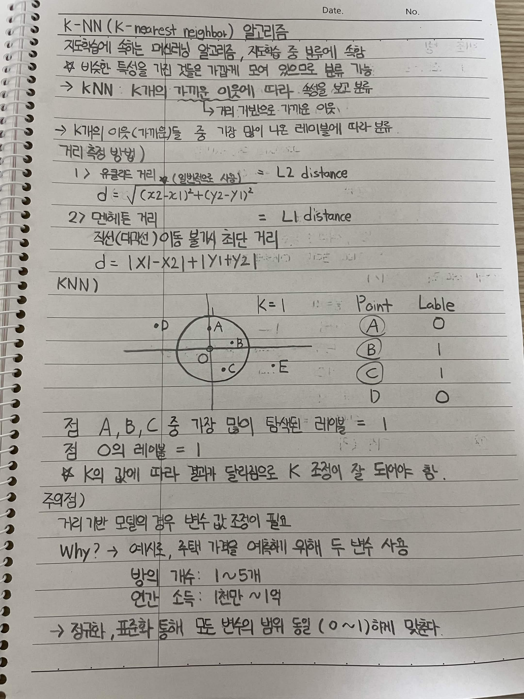
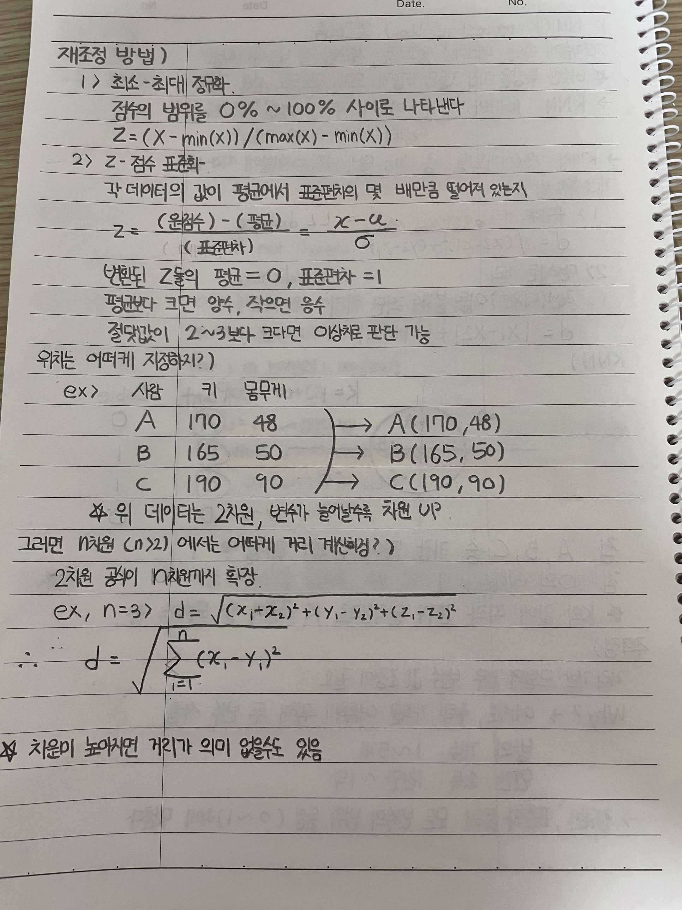

# K-NN (K-nearest neighbor) 알고리즘

지도학습에 속하는 머신러닝 알고리즘, 지도학습 중 분류에 속함.

* 비슷한 특성을 가진 것들은 가깝게 모여 있으므로 분류 가능
* **KNN**: K개의 가까운 이웃에 따라 특성을 보고 분류

  * 거리 기반으로 가까운 이웃을 찾음
* K개의 이웃 중 가장 많이 나온 레이블에 따라 분류

## 거리 측정 방법

### 1. 유클리드 거리

일반적으로 사용

**L2 distance**

d = √((x₂ - x₁)² + (y₂ - y₁)²)

### 2. 맨해튼 거리

직선(대각선) 이동 불가, 최단 거리

**L1 distance**

d = |x₁ - x₂| + |y₁ - y₂|

---

# KNN 예시

| Point | Label |
| :---: | :---: |
|   A   |   0   |
|   B   |   1   |
|   C   |   1   |
|   D   |   0   |

K = 1일 때, 새로운 점 **O**의 가장 가까운 점을 찾음.

* 점 A, B, C 중 가장 가까운 점의 레이블을 확인
* 가장 가까운 점의 레이블에 따라 점 O를 분류
* K의 값에 따라 결과가 달라질 수 있으므로 K 설정이 중요함

---

# 주의점

거리 기반 모델의 경우 **변수의 단위 및 범위에 따른 보정이 필요**하다.

### 예시

|  사람 |   키 | 몸무게 |
| :-: | --: | --: |
|  A  | 170 |  48 |
|  B  | 165 |  50 |
|  C  | 190 |  90 |

* 키: 165 ~ 190
* 몸무게: 48 ~ 90

변수마다 값의 범위가 다르기 때문에 특정 변수가 거리 계산에 더 큰 영향을 줄 수 있음.

따라서 **정규화 또는 표준화**를 통해 모든 변수의 범위를 맞춰준다.

---

# 데이터 재조정 방법

## 1. 최소-최대 정규화 (Min-Max Normalization)

값의 범위를 **0 ~ 1** 사이로 나타냄.

Z = (X - min(X)) / (max(X) - min(X))

## 2. Z-점수 표준화

각 데이터가 평균에서 표준편차의 몇 배만큼 떨어져 있는지 나타냄.

Z = (X - μ) / σ

### 특징

* 변환된 Z값의 평균 = 0
* 변환된 Z값의 표준편차 = 1
* 평균보다 크면 양수
* 평균보다 작으면 음수
* 절댓값이 2~3보다 크다면 이상치로 판단 가능

---

# 다차원 데이터에서의 거리

위의 데이터는 2차원 데이터이다.

* 키 → 1차원
* 몸무게 → 1차원
* 변수 2개 → 2차원

변수가 늘어날수록 차원도 증가한다.

* 변수 2개 → 2차원
* 변수 3개 → 3차원
* 변수 n개 → n차원

## n차원 유클리드 거리

2차원 공식을 n차원까지 확장하면 된다.

d = √(Σ(i=1~n) (xᵢ - yᵢ)²)

예를 들어 3차원이라면:

d = √((x₁ - y₁)² + (x₂ - y₂)² + (x₃ - y₃)²)

> 차원이 높아지면 거리의 의미가 약해질 수도 있음.

