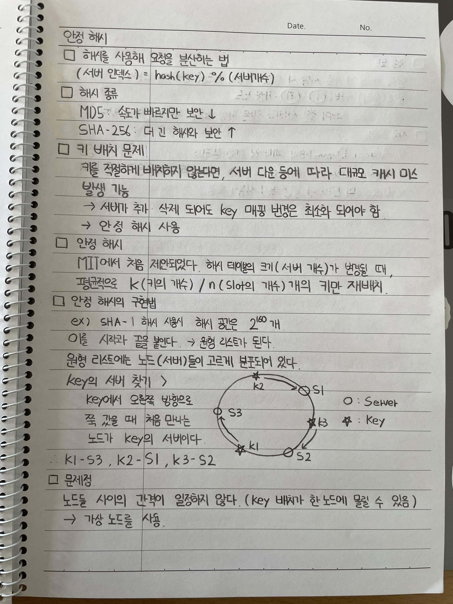
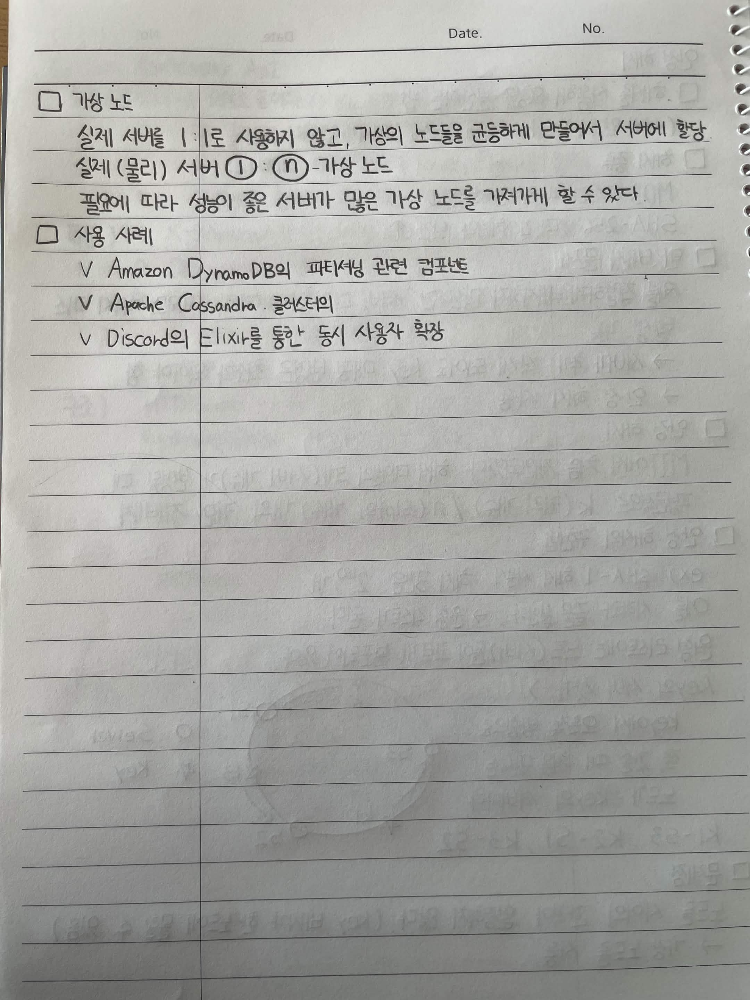

# 안정 해시

## 1. 안정 해시

* 해시를 사용해 요청을 분산하는 법

  * `(서버 인덱스) = hash(key) % (서버 개수)`

### 해시 종류

* **MD5**: 속도가 빠르지만 보안 ↓
* **SHA-256**: 더 긴 해시와 보안 ↑

### 리밸런싱 문제

* 키를 적절하게 배치하지 않는다면, 서버 다운 등에 따라 대규모 캐시 미스 발생 가능
* 서버가 추가·삭제되어도 key 매칭 변경은 최소화되어야 함
* → **안정 해시 사용**

### 안정 해시

* MIT에서 처음 제안되었다.
* 해시 테이블의 크기(서버 개수)가 변경될 때, 평균적으로 `K(키의 개수) / N(노드의 개수)`개의 키만 재배치

### 안정 해시의 구현법

예시) SHA-1 해시 사용 시 해시 공간은 `2^160`개

이를 시작과 끝을 붙인다. → **원형 리스트**가 된다.

원형 리스트에는 노드(서버)들이 고르게 분포되어 있다.

#### Key의 서버 찾기

Key에서 오른쪽 방향으로 쭉 갔을 때 처음 만나는 노드가 Key의 서버이다.

* `K1 → S3`
* `K2 → S1`
* `K3 → S2`

### 문제점

* 노드 사이의 간격이 일정하지 않다.

  * (Key 배치가 한 노드에 몰릴 수 있음)
* → **가상 노드를 사용**

---

# 가상 노드

실제 서버를 `1 : n`으로 사칭하지 않고, 가상의 노드를 균등하게 만들어서 서버에 할당

* 실제(물리) 서버 `1`
* `n`개의 가상 노드

필요에 따라 성능이 좋은 서버가 많은 가상 노드를 가져가게 할 수 있다.

### 사용 사례

* Amazon DynamoDB의 파티셔닝 관련 컴포넌트
* Apache Cassandra 클러스터
* Discord의 Elixir를 통한 동시 사용자 확장

