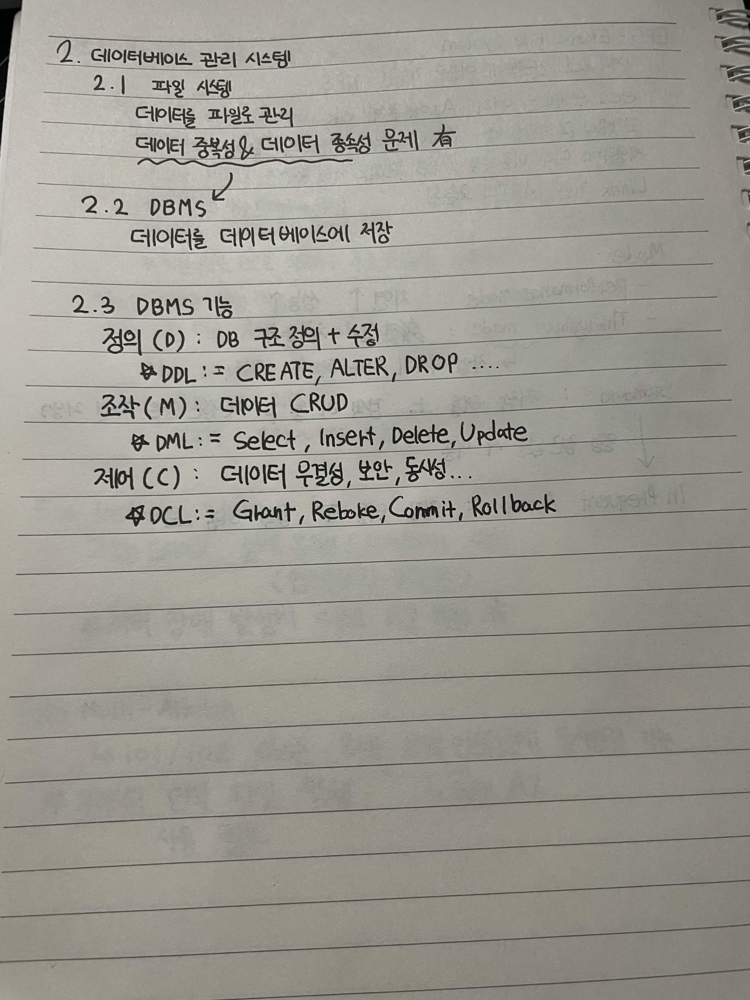

# 2. 데이터베이스 관리 시스템

## 2.1 파일 시스템

- 데이터를 파일로 관리
- 데이터 중복성과 데이터 종속성 문제가 있음

---

## 2.2 DBMS

- 데이터를 데이터베이스에 저장

---

## 2.3 DBMS 기능

### 정의 기능 (Definition)

- 데이터베이스의 구조를 생성하거나 수정

#### DDL (Data Definition Language)

- `CREATE` : 데이터베이스 객체 생성
- `ALTER` : 데이터베이스 객체 수정
- `DROP` : 데이터베이스 객체 삭제

---

### 조작 기능 (Manipulation)

- 데이터 CRUD 수행

#### DML (Data Manipulation Language)

- `SELECT` : 데이터 조회
- `INSERT` : 데이터 삽입
- `UPDATE` : 데이터 수정
- `DELETE` : 데이터 삭제

---

### 제어 기능 (Control)

- 데이터의 무결성, 보안, 동시성 등을 관리

#### DCL (Data Control Language)

- `GRANT` : 권한 부여
- `REVOKE` : 권한 회수
- `COMMIT` : 변경 내용 저장
- `ROLLBACK` : 변경 내용 취소

