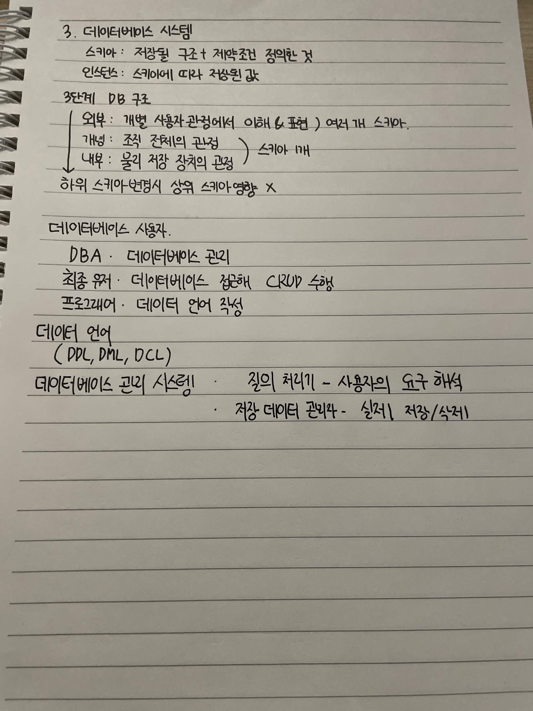

# 3. 데이터베이스 시스템

- 스키마 : 저장될 구조 + 제약조건 정의한 것
- 인스턴스 : 스키마에 따라 작성된 값

## 3단계 DB 구조

- 외부 : 개별 사용자 관점에서 이해 & 표현, 여러개 스키마
- 개념 : 조직 전체의 관점, 스키마 1개
- 내부 : 물리 저장 장치의 관점, 스키마 1개

하위 스키마 변경시 상위 스키마 영향 X

## 데이터베이스 사용자

- DBA : 데이터베이스 관리
- 최종 유저 : 데이터베이스 접근해 CRUD 수행
- 프로그래머 : 데이터 언어 작성

## 데이터 언어

- DDL
- DML
- DCL

## 데이터베이스 관리 시스템

- 질의 처리기 : 사용자의 요구 해석
- 저장 데이터 관리자 : 실제 저장, 삭제

