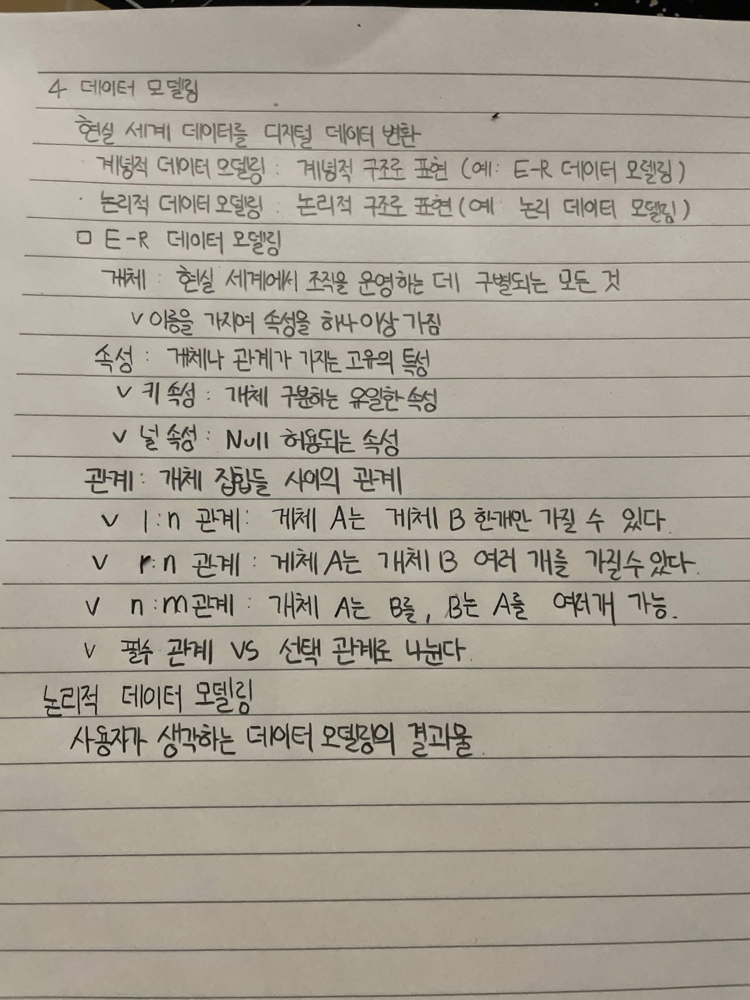

# 4. 데이터 모델링

현실 세계 데이터를 디지털 데이터로 변환

- 개념적 데이터 모델링 : 개념적 구조 표현 (예: E-R 데이터 모델링)
- 논리적 데이터 모델링 : 논리적 구조 표현 (예: 논리 데이터 모델링)

## E-R 데이터 모델링

개체 : 현실 세계에서 조직을 운영하는 데 구별되는 모든 것
  - 이름을 가지며 속성을 하나 이상 가짐

속성 : 개체나 관계가 가지는 고유의 특성
  - 키 속성 : 개체 구분하는 유일한 속성
  - 널 속성 : NULL 허용되는 속성

관계 : 개체 집합들 사이의 관계
  - 1 : n 관계 : 개체 A는 개체 B 한개만 가질 수 있다.
  - n : n 관계 : 개체 A는 개체 B 여러 개를 가질 수 있다.
  - n : m 관계 : 개체 A는 B를, B는 A를 여러 개 가능.
  - 필수 관계 VS 선택 관계로 나뉜다.

## 논리적 데이터 모델링

사용자가 생각하는 데이터 모델링의 결과물

