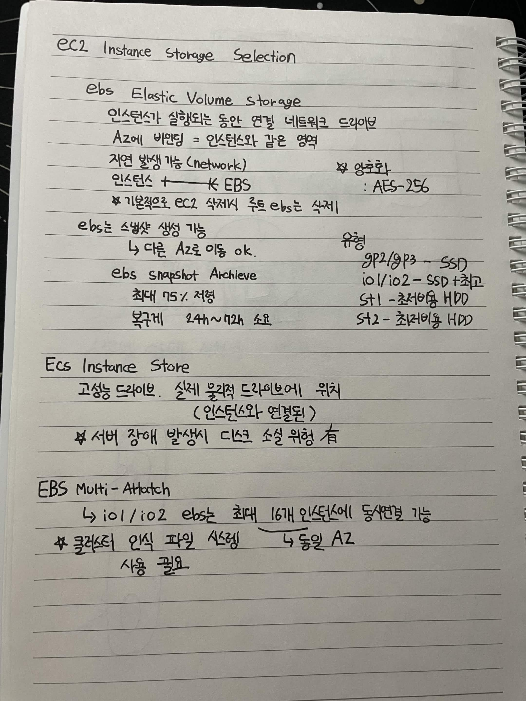

# EC2 Instance Storage Selection

## EBS (Elastic Volume Storage)

- 인스턴스가 실행되는 동안 연결되는 네트워크 드라이브
- AZ에 바인딩됨
  - 인스턴스와 같은 AZ에 있어야 함
- 네트워크 기반이라 지연(Network Latency) 발생 가능
- 기본적으로 EC2 삭제 시 루트 EBS도 함께 삭제
- AES-256 암호화 지원

### Snapshot

- EBS 스냅샷 생성 가능
- 다른 AZ로 이동 가능

#### EBS Snapshot Archive

- 최대 75% 비용 절감
- 복구에 24~72시간 소요

### Volume Type

- `gp2`, `gp3` : SSD
- `io1`, `io2` : 최고 성능 SSD
- `st1` : 저비용 HDD
- `st2` : 최저비용 HDD

---

## EC2 Instance Store

- 고성능 드라이브
- 실제 물리적 드라이브에 위치
- 인스턴스와 연결된 스토리지
- 서버 장애 발생 시 데이터 손실 위험이 있음

---

## EBS Multi-Attach

- `io1`, `io2` EBS만 지원
- 동일 AZ 내에서 최대 16개의 인스턴스에 동시 연결 가능
- 클러스터 인식 파일 시스템 사용 필요

---

## EFS (Elastic File System)

- 여러 EC2 인스턴스에서 마운트 가능한 NFS
- 여러 AZ에 있는 EC2 인스턴스에서 사용 가능
- 고가용성 및 확장성 제공
- 비용은 GP2 대비 약 3배
- 사용량에 따라 비용 측정
- PB 단위까지 자동 확장
- Linux 기반 AMI와 호환

### Mode

#### Performance Mode

- 지연 증가
- 성능 증가

#### Throughput Mode

- 처리량 증가
- 작업 부하에 따라 처리량 조절

### Storage Class

#### Standard

- 저장 비용 높음
- 검색 비용 낮음
- 일정 기간 접근이 없으면 Infrequent Access로 이동

#### Infrequent Access

- 저장 비용 낮음
- 검색 비용 높음

