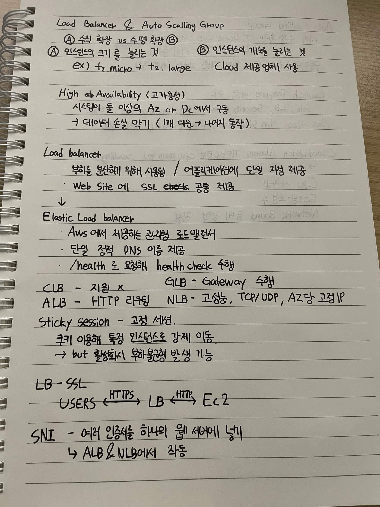
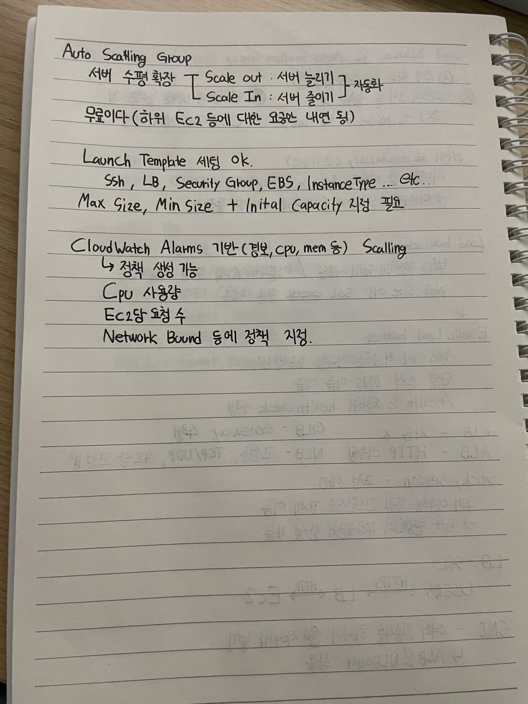

# Load Balancer & Auto Scalling Group

## A. 수직 확장 vs 수평 확장 B

### A
- 인스턴스의 크기를 늘리는 것
- ex) t2.micro → t2.large

### B
- 인스턴스의 개수를 늘리는 것
- Cloud 제공업체 사용

## High Availability (고가용성)

- 시스템이 둘 이상의 AZ or DC에서 가동
- → 데이터 손실 막기 (1개 다운 → 나머지 동작)

## Load balancer

- 부하를 분산해 위해 사용됨 / 어플리케이션에 단일 지점 제공
- Web Site 에 SSL check 공통 제공

## Elastic Load balancer

- Aws 에서 제공하는 관리형 로드밸런서
- 단일 정적 DNS 이름 제공
- /health 로 요청해 health check 수행

- CLB - 지원 x
- ALB - HTTP 라우팅
- GLB - Gateway 수행
- NLB - 고성능, TCP/UDP, AZ당 고정 IP

### Sticky Session

- 고정 세션.
- 쿠키 이용해 특정 인스턴스로 강제 이동.
- → but 활성화시 부하불균형 발생 가능

## LB - SSL

USERS ← HTTPS → LB ← HTTP → Ec2

## SNI

- 여러 인증서를 하나의 웹 서버에 넣기
- ALB & NLB에서 작동

---

## Auto Scalling Group

- 서버 수평확장
  - Scale out : 서버 늘리기
  - Scale In : 서버 줄이기
  - 자동화

- 무료이다 (하위 Ec2 등에 대한 요금은 내면 됨)

### Launch Template

- 세팅 ok.
- Ssh, LB, Security Group, EBS, InstanceType ... etc..
- Max Size, Min Size + Initial Capacity 지정 필요

### CloudWatch Alarms 기반 (집보, cpu, mem 등) Scalling

- 정책 생성 가능

- CPU 사용량
- Ec2당 요청 수
- Network Bound 등에 정책 지정.

