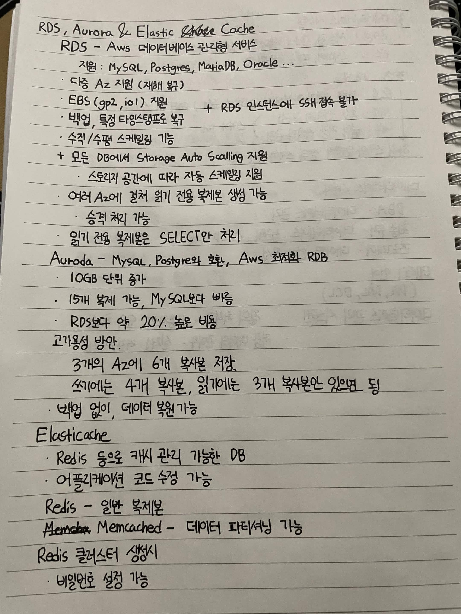

# RDS, Aurora & Elasticache

## RDS - Aws 데이터베이스 관리형 서비스

지원 : MySQL, Postgres, MariaDB, Oracle ...

- 다중 Az 지원 (재해 복구)
- EBS (gp2, io1) 지원
+ RDS 인스턴스에 SSH 접속 불가
- 백업, 특정 타임스탬프로 복구
- 수직/수평 스케일링 기능

+ 모든 DB에서 Storage Auto Scalling 지원
- 스토리지 공간에 따라 자동 스케일링 지원
- 여러 AZ에 걸쳐 읽기 전용 복제본 생성 가능
  - 승격 처리 가능
- 읽기 전용 복제본은 SELECT만 처리

## Auroda - Mysql, Postgres와 호환, Aws 최적화 RDB

- 10GB 단위 증가
- 15개 복제 가능, MySQL보다 빠름
- RDS보다 약 20% 높은 비용

## 고가용성 방안

3개의 Az에 6개 복사본 저장,
셋에는 4개 복사본, 읽기에는 3개 복사본 있어야 됨

- 백업 없이 데이터 복원 가능

## Elasticache

- Redis 등으로 캐시 관리 가능한 DB
- 애플리케이션 코드 수정 가능

Redis - 일반 복제본

Memcached - 데이터 파티셔닝 가능

Redis 클러스터 생성시

- 비밀번호 설정 가능

