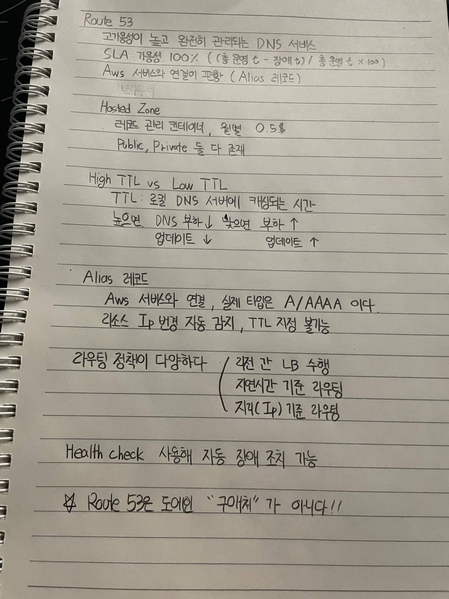

# Route 53

고가용성이 높고 완전히 관리되는 DNS 서비스

SLA 가용성 100% ((총 운영 t - 장애 t) / 총 운영 t × 100)

AWS 서비스와 연결이 편함 (Alias 레코드)

## Hosted Zone

레코드 관리 컨테이너, 월별 0.5$

Public, Private 둘 다 존재

## High TTL vs Low TTL

TTL: 로컬 DNS 서버에 캐싱되는 시간

높으면 
DNS 부하 ↓
업데이트 ↓

낮으면 
부하 ↑
업데이트 ↑

## Alias 레코드

AWS 서버와 연결, 실제 타입은 A/AAAA 이다

리소스 IP 변경 자동 감지, TTL 지정 불가능

라우팅 정책이 다양하다

리전 간 LB 수행
지연시간 기준 라우팅
지리적 IP 기준 라우팅

## Health Check

사용해 지동 장애 조치 기능

### Route 53은 도메인 "구매"가 아니다!!
