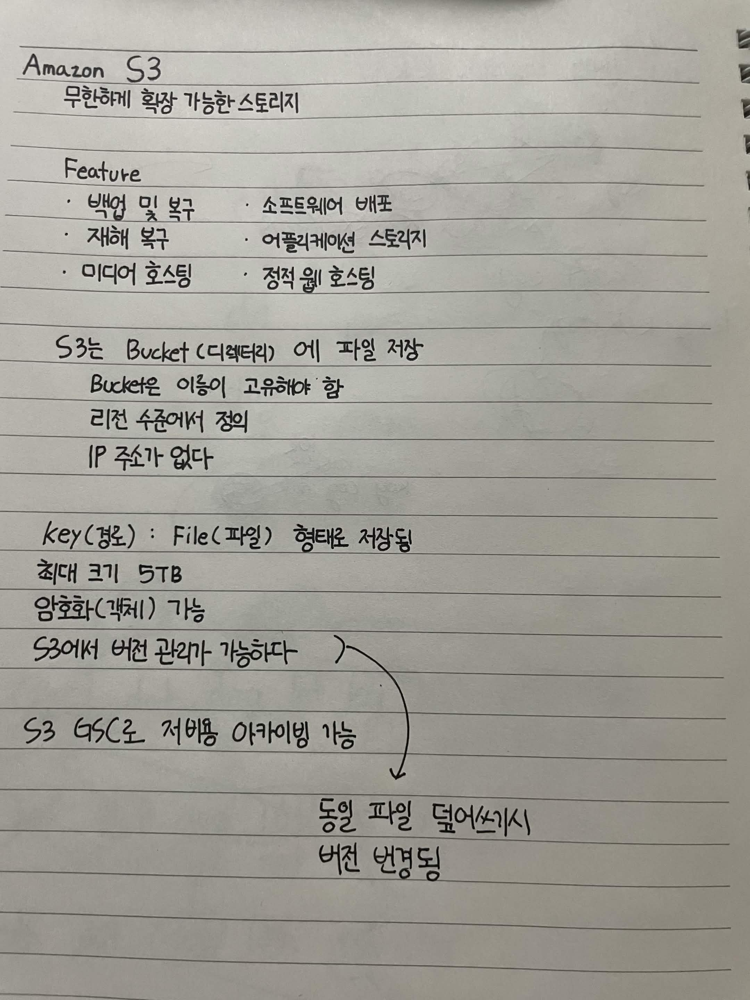

# Amazon S3

무한하게 확장 가능한 스토리지

## Feature

- 백업 및 복구
- 소프트웨어 배포
- 재해 복구
- 어플리케이션 스토리지
- 미디어 호스팅
- 정적 웹 호스팅

S3는 Bucket (디렉터리) 에 파일 저장
Bucket은 이름이 고유해야 함
리전 수준에서 정의
IP 주소가 없다

key(경로) : File(파일) 형태로 저장됨
최대 크기 5TB
암호화(객체) 가능
S3에서 버전 관리가 가능하다

S3 GSC로 저비용 아카이빙 가능

동일 파일 덮어쓰기시
버전 반영됨

