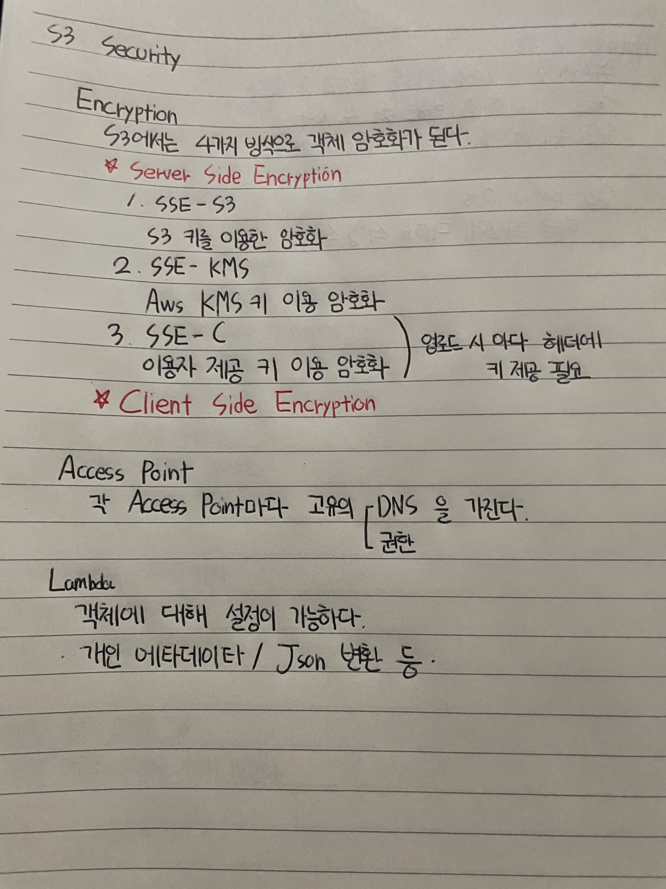

# S3 Security

## Encryption

S3에서는 4가지 방식으로 객체 암호화가 된다.

### Server Side Encryption

1. SSE-S3
   - S3 키를 이용한 암호화

2. SSE-KMS
   - AWS KMS 키를 이용한 암호화

3. SSE-C
   - 사용자가 제공한 키를 이용한 암호화
   - 업로드 시마다 헤더에 키 제공 필요

### Client Side Encryption

1. 클라이언트 직접 암호화
   - 클라이언트에서 직접 암호화 해 업로드한다
   - 클라이언트에서 직접 복호화한다

## Access Point

각 Access Point마다 고유의 DNS를 가진다.

권한 설정 가능

## Lambda

객체에 대해 설정이 가능하다.
```
- 개인 메타데이터
- JSON 변환 등
```

