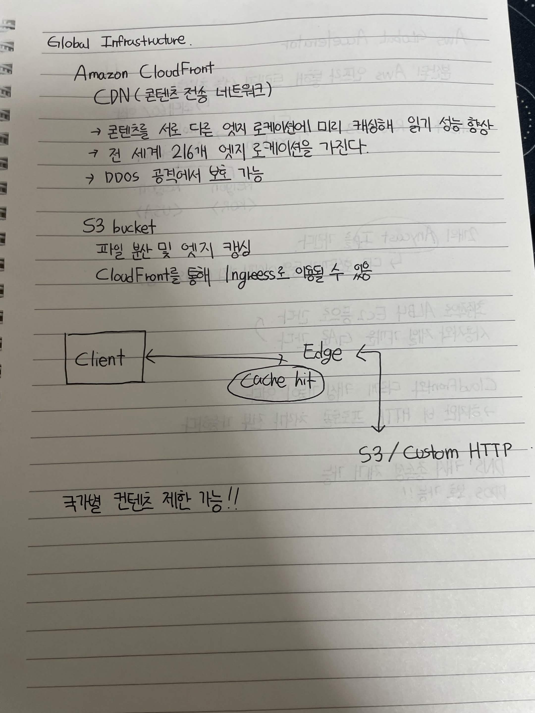
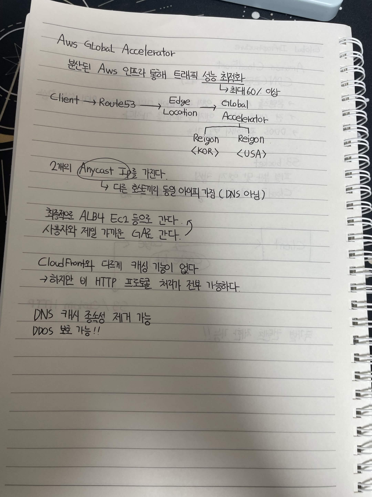

# Global Infrastructure

## Amazon CloudFront

CDN (콘텐츠 전송 네트워크)

→ 콘텐츠를 서로 다른 엣지 로케이션에 미리 캐싱해 읽기 성능 향상

→ 전 세계 216개 엣지 로케이션을 가진다.

→ DDOS 공격에서 보호 가능

## S3 bucket

파일 분산 및 엣지 캐싱

CloudFront를 통해 Ingress로 인입될 수 있음

```text
Client ←────────→ Edge
                  │
               Cache hit
                  │
                  ↓
            S3 / Custom HTTP
```
- 국가별 콘텐츠 제한 가능!!

# AWS Global Accelerator

분산된 AWS 인프라를 통해 트래픽 성능 최적화
→ 최대 60% 이상

```
Client → Route53 → Edge Location → Global Accelerator
                                      ↓        ↓
                              Region <KOR>  Region <USA>
```

## 특징

2개의 Anycast IP를 가진다.
→ 다른 호스트에게 동일 IP를 가짐 (DNS 아님)

최종적으로 ALB나 EC2 등으로 간다.
사용자와 제일 가까운 GA로 간다.

CloudFront와 다르게 캐싱 기능이 없다.
→ 하지만 비 HTTP 프로토콜 처리가 전부 가능하다.

DNS 캐시 종속성 제거 가능

DDOS 보호 가능!!


