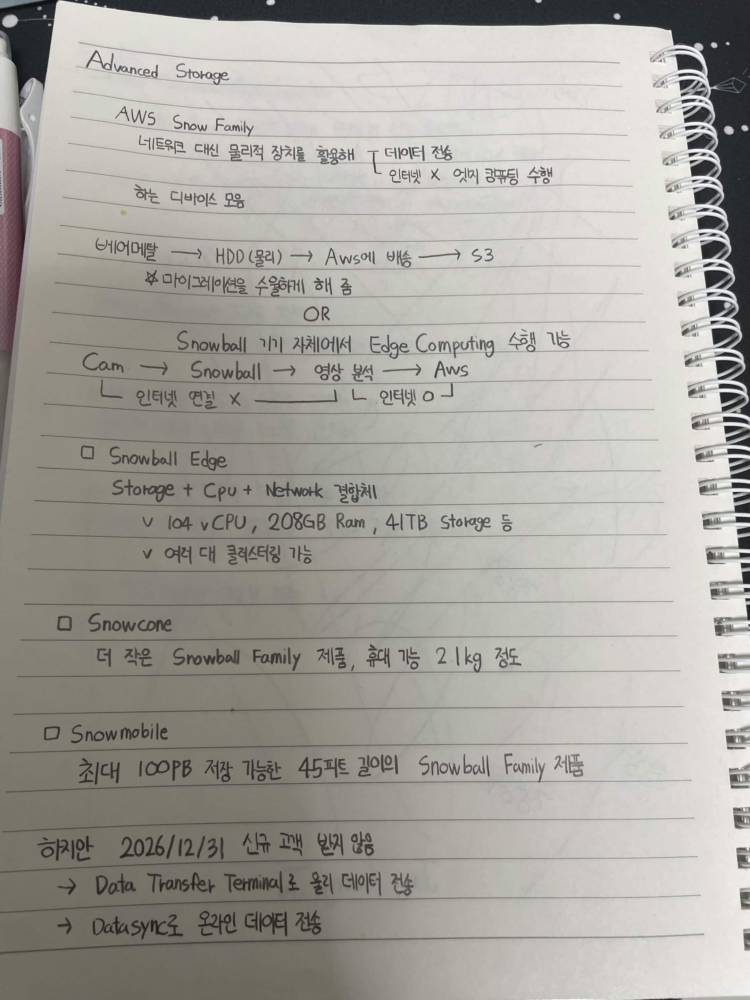

# Advanced Storage

## AWS Snow Family

네트워크 대신 물리적 장치를 활용해 데이터 전송
ㄴ 인터넷 X 엣지 컴퓨팅 수행
하는 디바이스 모음

베어메탈 → HDD (물리) → AWS에 배송 → S3
☆ 마이그레이션을 수월하게 해 줌

OR

Snowball 기기 자체에서 Edge Computing 수행 가능
Cam → Snowball → 영상 분석 → AWS
　ㄴ 인터넷 연결 X　　　　　　ㄴ 인터넷 O

* Snowball Edge

  Storage + CPU + Network 결합체

  * 104 vCPU, 208GB Ram, 41TB Storage 등
  * 여러 대 클러스터링 가능

* Snowcone

  더 작은 Snowball Family 제품, 휴대 가능 2.1kg 정도

* Snowmobile

  최대 100PB 저장 가능한 45피트 길이의 Snowball Family 제품

하지만 2026/12/31 신규 고객 받지 않음
→ Data Transfer Terminal로 물리 데이터 전송
→ DataSync로 온라인 데이터 전송

