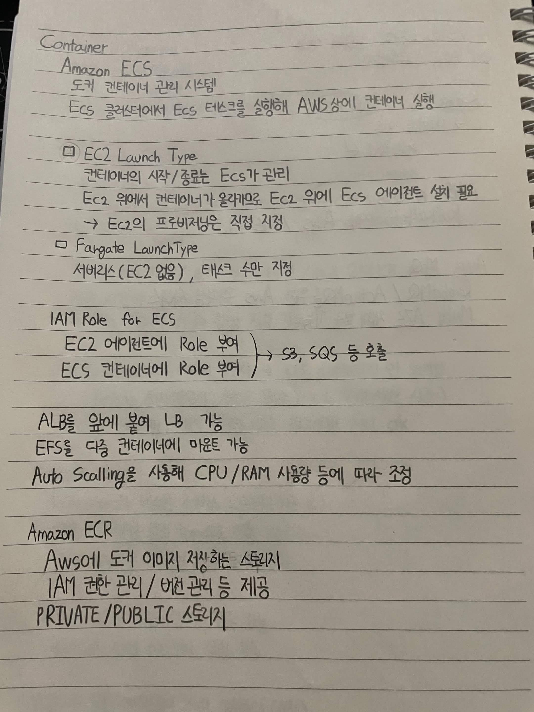
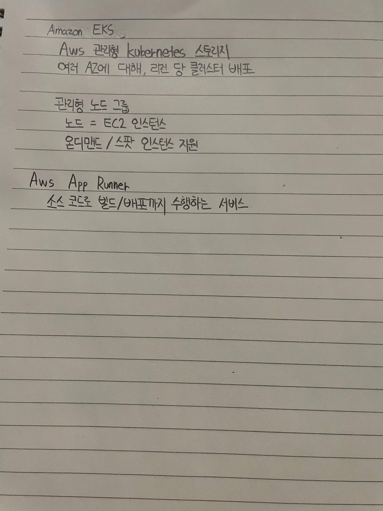

# Container

## Amazon ECS

도커 컨테이너 관리 시스템

ECS 클러스터에서 ECS 태스크를 실행해 AWS 상에 컨테이너 실행

### EC2 Launch Type

컨테이너의 시작/종료는 ECS가 관리

EC2 위에서 컨테이너가 올라가므로 EC2 위에 ECS 에이전트 설치 필요

-> EC2의 프로비저닝은 직접 지정

### Fargate Launch Type

서버리스 (EC2 없음), 태스크 수만 지정

## IAM Role for ECS

EC2 에이전트에 Role 부여
ECS 컨테이너에 Role 부여

-> S3, SQS 등 호출

ALB를 앞에 붙여 LB 가능

EFS를 특정 컨테이너에 마운트 가능

Auto Scaling을 사용해 CPU/RAM 사용량 등에 따라 조정

## Amazon ECR

AWS의 도커 이미지 저장하는 스토리지

IAM 권한 관리 / 버전 관리 등 제공

PRIVATE / PUBLIC 스토리지

## Amazon EKS

AWS 관리형 Kubernetes 서비스

여러 AZ에 대해, 리전 당 클러스터 배포

### 관리형 노드 그룹

노드 = EC2 인스턴스

온디맨드 / 스팟 인스턴스 지원

## AWS App Runner

소스 코드 빌드/배포까지 수행하는 서비스

