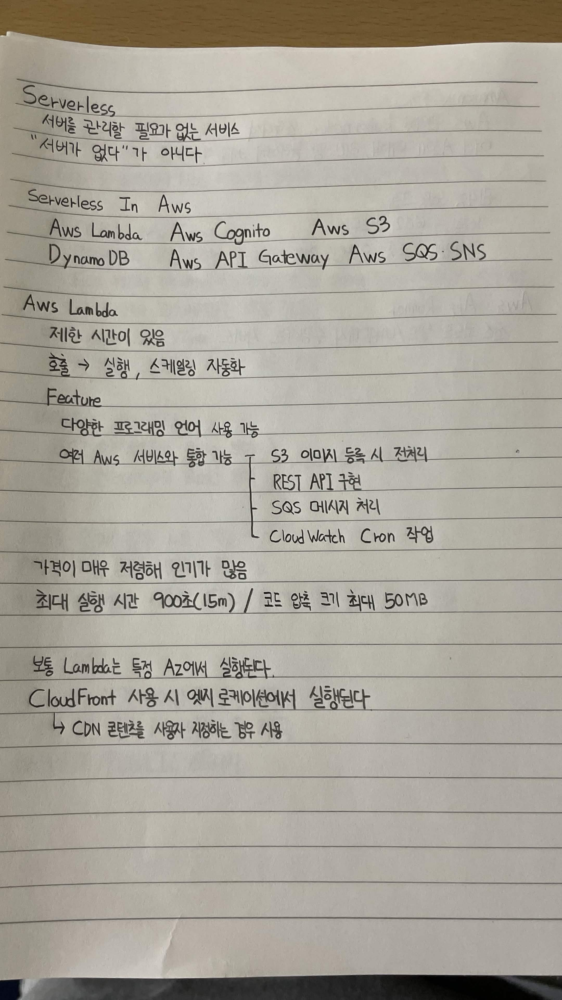
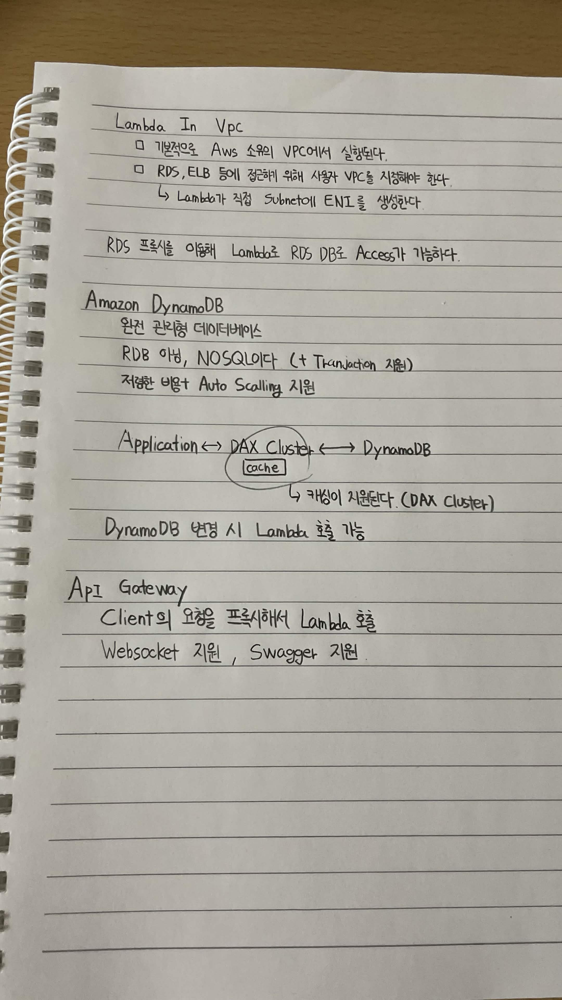
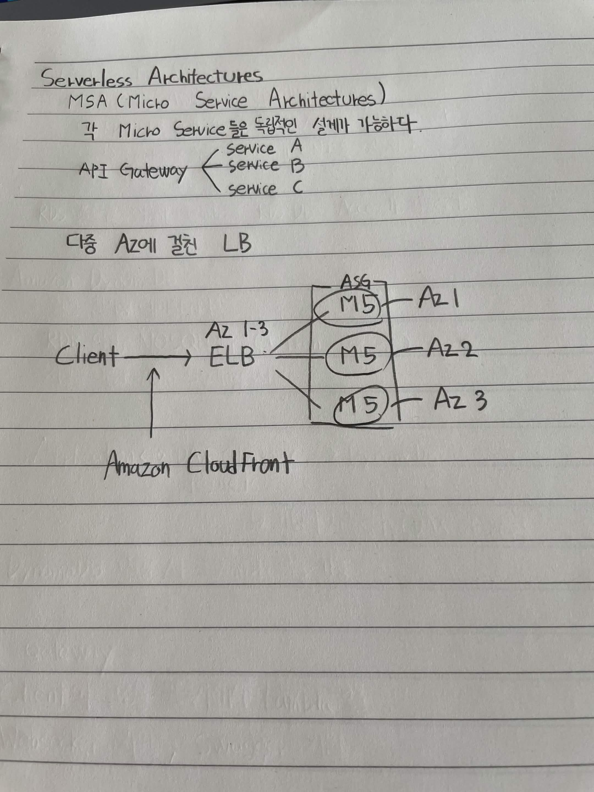

# Serverless

## Serverless

서버를 관리할 필요가 없는 서비스
"서버가 없다"가 아니다.

## Serverless in AWS

* AWS Lambda
* AWS Cognito
* AWS S3
* DynamoDB
* AWS API Gateway
* AWS SQS · SNS

## AWS Lambda

* 제한 시간이 있음
* 호출 → 실행, 스케일링 자동화
* 다양한 프로그래밍 언어 사용 가능
* 여러 AWS 서비스와 통합 가능

  * S3 이미지 등록 시 전처리
  * REST API 구현
  * SQS 메시지 처리
  * CloudWatch Cron 작업
* 가격이 매우 저렴해 인기가 많음
* 최대 실행 시간 900초(15분)
* 코드 압축 크기 최대 50MB
* 보통 Lambda는 특정 AZ에서 실행됨
* CloudFront 사용 시 엣지 로케이션에서 실행됨

  * CDN 콘텐츠를 사용자 지정하는 경우 사용

## Lambda in VPC

* 기본적으로 AWS 소유의 VPC에서 실행된다.
* RDS, ELB 등에 접근하기 위해 사용자 VPC를 지정해야 한다.

  * Lambda가 직접 Subnet에 ENI를 생성한다.
* RDS Proxy를 이용해 Lambda로 RDS DB에 Access가 가능하다.

## Amazon DynamoDB

* 완전 관리형 데이터베이스
* RDB가 아닌 NoSQL이다. (Transaction 지원)
* 저렴한 비용 + Auto Scaling 지원

### DynamoDB 구조

`Application ↔ DAX Cluster ↔ DynamoDB`

* DAX Cluster: DynamoDB의 캐시
* 캐싱이 지원된다. (DAX Cluster)
* DynamoDB 변경 시 Lambda 호출 가능

## API Gateway

* Client의 요청을 프록시해서 Lambda 호출
* WebSocket 지원
* Swagger(OpenAPI) 지원



# Serverless Architectures

## MSA (Micro Service Architectures)

각 Micro Service를 독립적인 설계가 가능하다.

```text
                    ┌─ Service A
API Gateway ────────┼─ Service B
                    └─ Service C
```

## 다중 AZ에 걸친 LB

```text
                         ASG
                  ┌─────────────────┐
                  │  ┌───────────┐  │
                  │  │    MS     │──┼── AZ1
                  │  └───────────┘  │
                  │  ┌───────────┐  │
Client ──→ ELB ────┤  │    MS     │──┼── AZ2
                  │  └───────────┘  │
                  │  ┌───────────┐  │
                  │  │    MS     │──┼── AZ3
                  │  └───────────┘  │
                  └─────────────────┘
```

