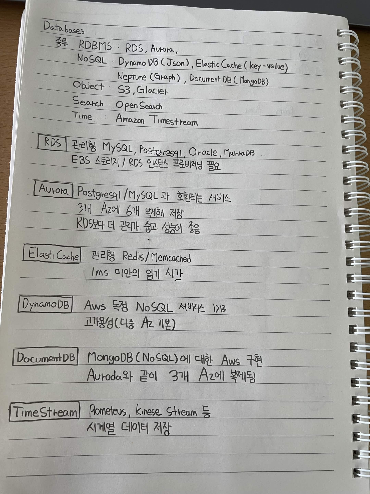

# Databases

## 종류

RDBMS: RDS, Aurora

NoSQL: DynamoDB (Json), ElastiCache (Key-Value)
Neptune (Graph), DocumentDB (MongoDB)

Object: S3, Glacier

Search: OpenSearch

Time: Amazon Timestream

## RDS

관리형 MySQL, PostgreSQL, Oracle, MariaDB ...

EBS 스토리지 / RDS 인스턴스 프로비저닝 필요

## Aurora

PostgreSQL / MySQL과 호환되는 서비스

3개 AZ에 6개 복제 저장

RDS보다 더 관리가 좋고 성능이 좋음

## ElastiCache

관리형 Redis/Memcached

1ms 미만의 읽기 시간

## DynamoDB

AWS 독점 NoSQL 서버리스 DB

고가용성 (다중 AZ 기본)

## DocumentDB

MongoDB (NoSQL)에 대한 AWS 구현

Aurora와 같이 3개 AZ에 복제됨

## Timestream

Prometheus, Kinesis Stream 등

시계열 데이터 저장

