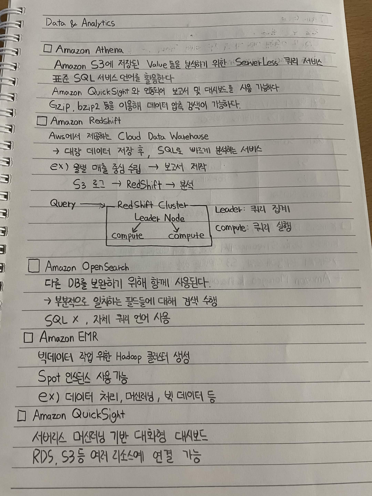
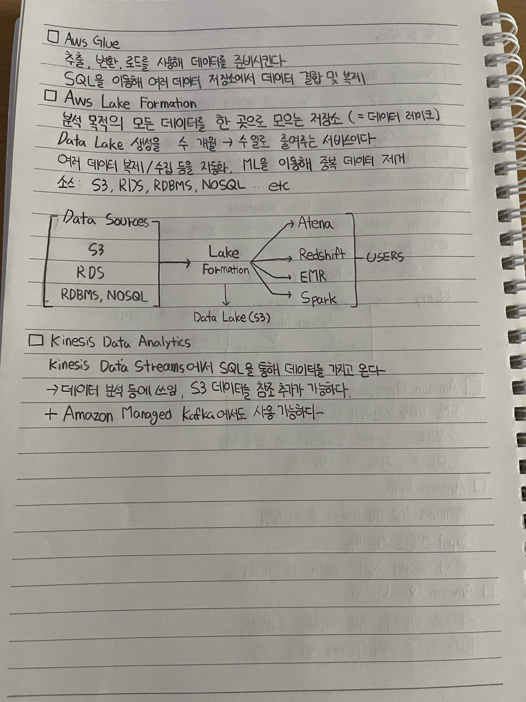

# Data & Analytics

## AWS Glue

* 추출, 변환, 로드를 사용해 데이터를 준비시킨다.
* SQL을 이용해 여러 데이터 저장소에서 데이터 결합 및 복제를 수행한다.

## AWS Lake Formation

* 분석 목적의 모든 데이터를 한 곳으로 모으는 저장소 (= 데이터 레이크)
* Data Lake 생성을 수개월 → 수일로 줄여주는 서비스이다.
* 여러 데이터 복사/수집 등을 자동화하고, ML을 이용해 중복 데이터를 제거한다.
* 데이터 소스

  * S3
  * RDS
  * RDBMS
  * NoSQL
  * etc.

### Lake Formation 구조

```text
Data Sources
├── S3
├── RDS
└── RDBMS, NoSQL
        │
        ▼
  Lake Formation
     ├── Athena
     ├── Redshift
     ├── EMR
     └── Spark
        │
        ▼
   Data Lake (S3)
```

## Kinesis Data Analytics

* Kinesis Data Streams와 SQL을 통해 데이터를 가져온다.
* 데이터 분석 등에 쓰이며 S3 데이터를 참조 및 추가할 수 있다.
* Amazon Managed Kafka도 사용할 수 있다.

## Amazon Athena

* Amazon S3에 저장된 데이터를 분석하기 위한 Serverless 쿼리 서비스
* 표준 SQL 쿼리 언어를 활용한다.
* Amazon QuickSight와 연동하여 보고서 및 대시보드로 사용할 수 있다.
* Gzip, bzip2 등을 이용해 데이터 압축 및 검색이 가능하다.

## Amazon Redshift

* AWS에서 제공하는 Cloud Data Warehouse
* 대량의 데이터를 저장한 후 SQL을 빠르게 분석하는 서비스
* 예시

  * 월별 매출 중심 수립 → 보고서 제작
  * S3 로그 → Redshift → 분석

### Redshift Cluster

```text
Query
  │
  ▼
┌──────────────────────────┐
│     RedShift Cluster     │
│                          │
│      Leader Node         │
│       ↙       ↘          │
│   Compute    Compute     │
│                          │
└──────────────────────────┘
```

* Leader Node: 쿼리 집계
* Compute Node: 쿼리 실행

## Amazon OpenSearch

* 다른 DB를 보완하기 위해 함께 사용된다.
* 부분적으로 일치하는 필드에 대해 검색을 수행한다.
* SQL을 사용하지 않고 자체 쿼리 언어를 사용한다.

## Amazon EMR

* 빅데이터 작업을 위한 Hadoop 클러스터를 생성한다.
* Spot 인스턴스를 사용할 수 있다.
* 예시

  * 데이터 처리
  * 머신러닝
  * 빅데이터 등

## Amazon QuickSight

* 서버리스 머신러닝 기반 대화형 대시보드
* RDS, S3 등 여러 리소스에 연결할 수 있다.



