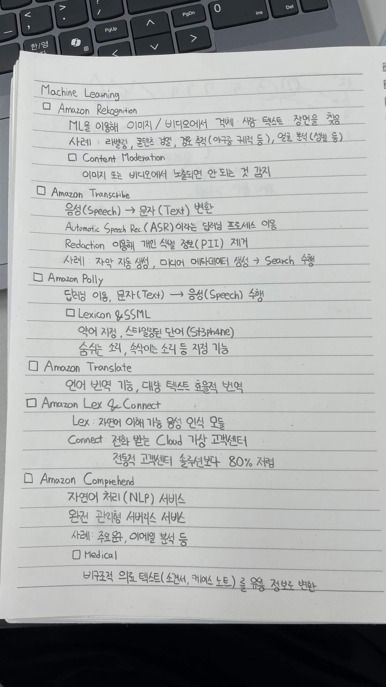
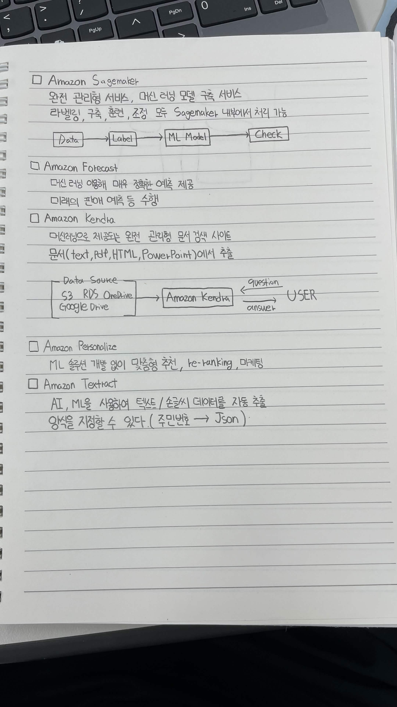

# AWS Machine Learning 서비스

* Amazon SageMaker

  * 완전 관리형 서비스, 머신 러닝 모델 구축 서비스
  * 라벨링, 구축, 훈련, 조정 모두 SageMaker 내부에서 처리 가능
  * `Data → Label → ML Model → Check`

* Amazon Forecast

  * 머신 러닝을 이용해 매우 정확한 예측 제공
  * 미래의 판매 예측 등을 수행

* Amazon Kendra

  * 머신러닝으로 제공되는 완전 관리형 문서 검색 사이트
  * 문서(Text, PDF, HTML, PowerPoint)에서 추출
  * `S3, RDS, OneDrive, Google Drive → Amazon Kendra → USER`
  * USER가 `question`을 보내면 Kendra가 `answer`를 제공

* Amazon Personalize

  * ML 솔루션 개발 없이 맞춤형 추천, re-ranking, 마케팅

* Amazon Textract

  * AI, ML을 사용하여 텍스트 / 손글씨 데이터를 자동 추출
  * 양식을 지정할 수 있다. (`주민번호 → JSON`)

* Amazon Rekognition

  * ML을 이용해 이미지 / 비디오에서 객체, 사람, 텍스트, 장면을 찾음
  * 사례: 라벨링, 콘텐츠 검열, 공공 추적(아동 및 위험 등), 얼굴 분석(성별 등)
  * Content Moderation

    * 이미지 또는 비디오에서 노출되면 안 되는 것 감지

* Amazon Transcribe

  * 음성(Speech) → 문자(Text) 변환
  * Automatic Speech Rec. (ASR)이라는 딥러닝 프로세스 이용
  * Redaction을 이용해 개인 식별 정보(PII) 제거
  * 사례: 자막 자동 생성, 미디어 메타데이터 생성 → Search 수행

* Amazon Polly

  * 딥러닝 이용, 문자(Text) → 음성(Speech) 수행
  * Lexicon & SSML

    * 약어 지정, 스타일링된 단어 지정 (`S3?Phone`)
    * 숨쉬는 소리, 속삭이는 소리 등 지정 가능

* Amazon Translate

  * 언어 번역 기능, 대량 텍스트 효율적 번역

* Amazon Lex & Connect

  * Lex: 자연어 이해 가능 음성 인식 모듈
  * Connect: 전화 받는 Cloud 가상 고객센터
  * 전통적 고객센터 솔루션보다 80% 저렴

* Amazon Comprehend

  * 자연어 처리(NLP) 서비스
  * 완전 관리형 서버리스 서비스
  * 사례: 주문, 이메일 분석 등
  * Medical

    * 비구조적 의료 텍스트(소견서, 케이스 노트)를 유용 정보로 변환

