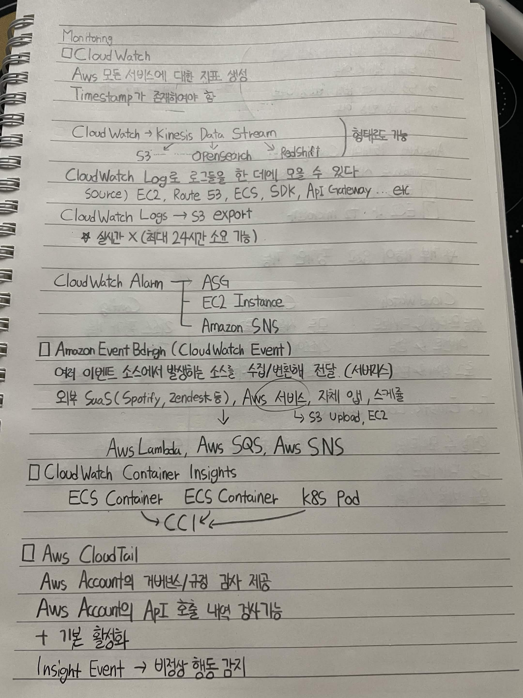
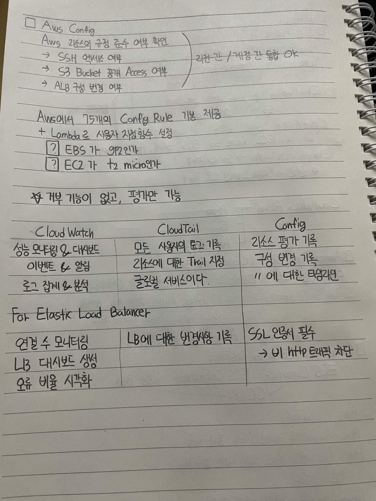

# Monitoring

## CloudWatch

AWS 모든 서비스에 대한 지표 생성

Timestamp가 존재해야 함

### CloudWatch → Kinesis Data Stream

- S3
- OpenSearch
- Redshift

형태로도 가능

CloudWatch Log를 로그들을 한데 모을 수 있다.

Source:
- EC2
- Route 53
- ECS
- SDK
- API Gateway
- 기타

### CloudWatch Logs → S3 Export

> 실시간 X (최대 24시간 소요 가능)

### CloudWatch Alarm

- ASG
- EC2 Instance
- Amazon SNS

## Amazon EventBridge (CloudWatch Event)

여러 이벤트 소스에서 발생하는 소스를 수집/변환해 전달 (서버리스)

외부 SaaS (Spotify, Zendesk 등), AWS 서비스, 자체 앱, 스케줄
→ AWS Lambda, AWS SQS, AWS SNS

AWS 서비스
→ S3 Upload, EC2

## CloudWatch Container Insights

- ECS Container
- ECS Container
- K8S Pod

→ CCI

## AWS CloudTrail

AWS Account의 거버넌스/규정 감사 제공

AWS Account의 API 호출 내역 감시 기능

+ 기본 활성화

Insight Event → 비정상 행동 감지

## AWS Config

AWS 리소스의 규정 준수 여부 확인

- SSH 액세스 여부
- S3 Bucket 공개 Access 여부
- ALB 구성 변경 여부

→ 관련 권한/계정권한 통합 OK

AWS에서 75개의 Config Rule 기본 제공

+ Lambda로 사용자가 지정하는 설정

#### Example
- [ ] EBS가 gp2인가
- [ ] EC2가 t2.micro인가

> 대부분 기능이 없고, 평가만 가능

| CloudWatch | CloudTrail | Config |
|---|---|---|
| 성능 모니터링 & 대시보드 | 모든 사용자의 로그 기록 | 리소스 평가 기록 |
| 이벤트 & 알림 | 리소스에 대한 Trail 지정 | 구성 변경 기록 |
| 로그 집계 & 분석 | 글로벌 서비스이다. | 구성 변경에 대한 타임라인 |

### Elastic Load Balancer 에서

| CloudWatch | CloudTrail | Config |
|---|---|---|
| 연결 수 모니터링 | LB에 대한 변경사항 기록 | SSL 인증서 필수 |
| L3 대시보드 생성 |  | → 비 HTTP 트래픽 차단 |
| 오류 비율 시각화 |  |

