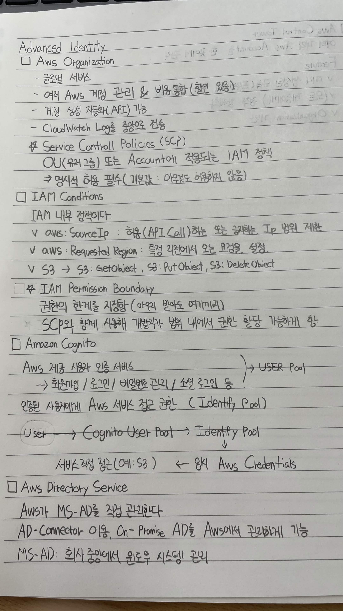
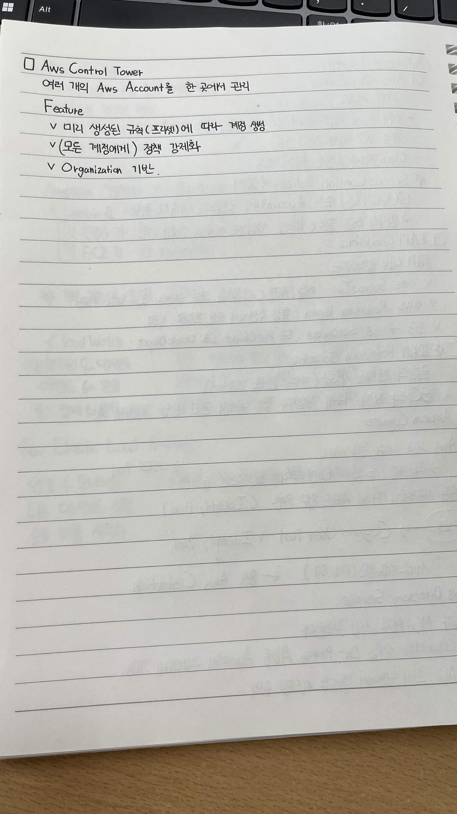

# Advanced Identity

## AWS Organizations

- 글로벌 서비스
- 여러 AWS 계정 관리 & 비용 통합 (할인 있음)
- 계정 생성 자동화(API) 기능
- CloudWatch Log를 중앙으로 전송

## Service Control Policies (SCP)

- OU(조직 그룹) 또는 Account에 적용되는 IAM 정책
- 명시적 허용 필수
  - 기본값: 아무것도 허용되지 않음

## IAM Conditions

- IAM 내부 정책이다.
- `aws:SourceIp`
  - 허용(API Call)하는 IP 범위 제한
- `aws:RequestedRegion`
  - 특정 리전에서 오는 요청을 설정
- S3
  - `s3:GetObject`
  - `s3:PutObject`
  - `s3:DeleteObject`

## IAM Permission Boundary

- 권한의 한계를 지정 (아무리 받아도 여기까지)
- SCP와 함께 사용해 개발자가 범위 내에서 권한 할당 가능하게 함

## Amazon Cognito

- AWS 제공 사용자 인증 서비스
- 회원가입 / 로그인 / 비밀번호 관리 / 소셜 로그인 등
  - **User Pool**
- 인증된 사용자에게 AWS 서비스 접근 권한
  - **Identity Pool**

```text
User
  ↓
Cognito User Pool
  ↓
Identity Pool
  ↓
임시 AWS Credentials
  ↓
AWS 서비스 직접 접근 (예: S3)
```

## AWS Directory Service

- AWS가 MS-AD를 직접 관리한다.
- **AD Connector**
  - On-Premise AD를 AWS에서 관리하게 가능
- **MS-AD**
  - 회사 중앙에서 윈도우 시스템 관리

## AWS Control Tower

- 여러 개의 AWS Account를 한 곳에서 관리

### Feature

- 미리 생성된 규칙(프리셋)에 따라 계정 생성
- 모든 계정에 정책 강제화
- Organization 기반


