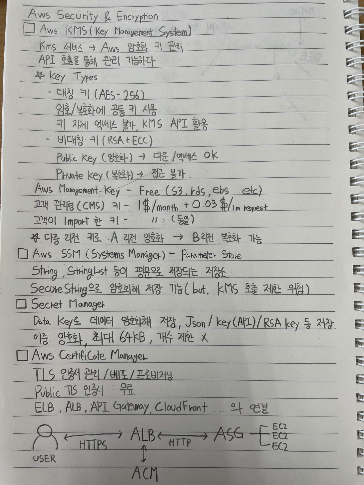
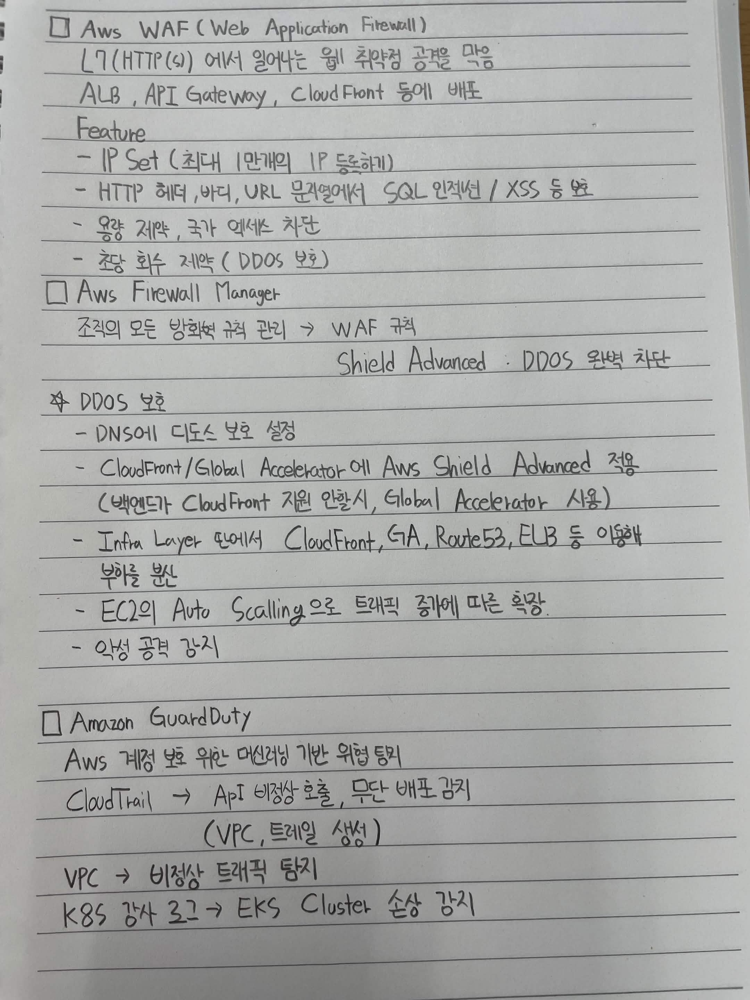

# AWS Security & Encryption

## AWS KMS (Key Management System)

* KMS란?

  * AWS 암호화 키 관리
  * API 호출을 통해 관리 가능

### Key Types

* **대칭 키 (AES-256)**

  * 암호/복호화에 공통 키 사용
  * 키 자체 액세스 불가, KMS API 활용

* **비대칭 키 (RSA + ECC)**

  * Public Key (암호화) → 더운/엑세스 OK
  * Private Key (복호화) → 접근 불가

### KMS 키 종류

* **AWS Management Key**

  * Free
  * S3, RDS, EBS 등

* **고객 관리형 (CMS) 키**

  * `$1/month + $0.03/1m request`

* **고객이 Import 한 키**

  * 고객 관리형 키와 동일

* **다중 리전 키**

  * A 리전에서 암호화 → B 리전에서 복호화 가능

---

## AWS SSM (Systems Manager) - Parameter Store

* String, StringList 등이 평문으로 저장되는 저장소
* SecureString으로 암호화해 저장 가능

  * 단, KMS 호출 제한은 위험

---

## Secret Manager

* Data Key로 데이터를 암호화해 저장
* JSON / Key(API) / RSA Key 등 저장
* 이중 암호화
* 최대 64KB
* 개수 제한 X

---

## AWS Certificate Manager

* TLS 인증서 관리 / 배포 / 프로비저닝
* Public TLS 인증서 → 무료
* ELB, ALB, API Gateway, CloudFront 등과 연결

```text
       HTTPS
USER ───────────→ ALB ───────────→ ASG
                  ↑      HTTP        ├── EC2
                  │                  ├── EC2
                 ACM                 └── EC2
```

---

# AWS WAF (Web Application Firewall)

* L7 (HTTP(s))에서 일어나는 웹 취약점 공격을 막음
* ALB, API Gateway, CloudFront 등에 배포

### Feature

* IP Set

  * 최대 1만 개의 IP 등록 가능
* HTTP 헤더, 바디, URL 문자열에서 SQL Injection / XSS 등 보호
* 용량 제한, 국가 예외 차단
* 초당 횟수 제한 (DDoS 보호)

---

# AWS Firewall Manager

* 조직의 모든 방화벽 규칙 관리 → WAF 규칙
* **Shield Advanced**

  * DDoS 완벽 차단

### DDoS 보호

* DNS에 디도스 보호 설정
* CloudFront / Global Accelerator에 AWS Shield Advanced 적용

  * 백엔드가 CloudFront를 지원 안 할 시 Global Accelerator 사용
* Infra Layer 단에서 CloudFront, GA, Route53, ELB 등으로 인프라 부하를 분산
* EC2의 Auto Scaling으로 트래픽 증가에 따른 확장
* 악성 공격 방지

---

# Amazon GuardDuty

* AWS 계정 보호를 위한 머신러닝 기반 위협 탐지

### CloudTrail

* API 비정상 호출
* 무단 배포 금지
* VPC, 트레일 생성 등

### VPC

* 비정상 트래픽 탐지

### Kubernetes

* 공격 탐지 → EKS Cluster 손상 감지


