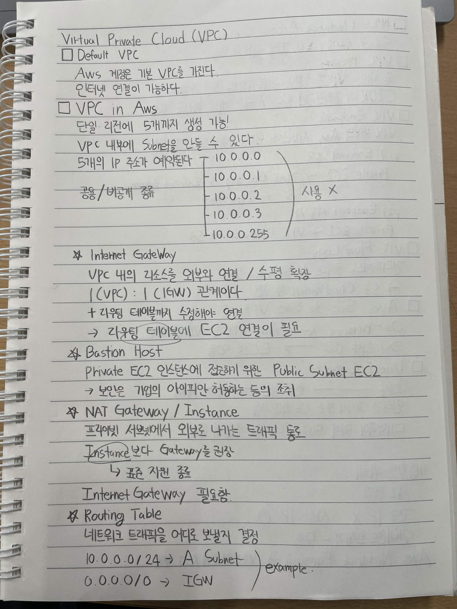
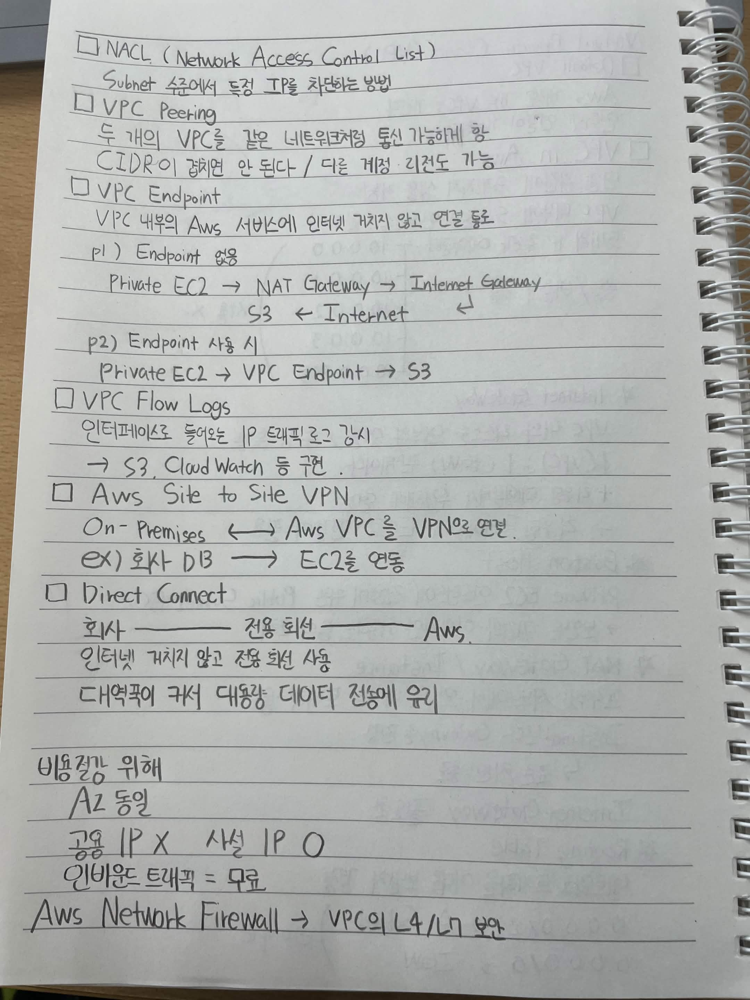

# Virtual Private Cloud (VPC)

## Default VPC

* AWS 계정은 기본 VPC를 가진다.
* 인터넷 연결이 가능하다.

## VPC in AWS

* 단일 리전에 **5개까지 생성 가능**
* VPC 내부에 **Subnet**을 만들 수 있다.
* Subnet을 만들 때 **5개의 IP 주소가 예약**된다.

```text
10.0.0.0
10.0.0.1
10.0.0.2
10.0.0.3
10.0.0.255
```

* 공용 / 비공개 IP 종류

---

## Internet Gateway

* VPC 내부의 리소스를 **외부와 연결 / 수평 확장**
* **1 VPC : 1 IGW** 관계
* 라우팅 테이블까지 수정해야 연결 가능
* 라우팅 테이블에 EC2 연결이 필요

---

## Bastion Host

* Private EC2 인스턴스에 접근하기 위한 **Public Subnet의 EC2**
* 보안 그룹에서 허용된 기업의 IP만 허용하는 등의 조치

---

## NAT Gateway / Instance

* **Private Subnet에서 외부로 나가는 트래픽**을 중계

```text
Private Subnet
      ↓
NAT Gateway
      ↓
Internet Gateway
      ↓
Internet
```

* NAT Instance보다 **NAT Gateway 권장**

  * 표준 지원
* Internet Gateway가 필요함

---

## Routing Table

> 네트워크 트래픽을 어디로 보낼지 결정

예시:

```text
10.0.0.0/24 → A Subnet
0.0.0.0/0   → IGW
```

---

# NACL (Network Access Control List)

* **Subnet 수준**에서 특정 IP를 차단하는 방법

---

# VPC Peering

* 두 개의 VPC를 **같은 네트워크처럼 통신 가능하게** 함
* CIDR이 겹치면 안 됨
* **다른 계정 / 다른 리전도 가능**

```text
VPC A  ←── VPC Peering ──→  VPC B
```

---

# VPC Endpoint

* VPC 내부의 AWS 서비스에 **인터넷을 거치지 않고 연결**하는 통로

### Endpoint가 없는 경우

```text
Private EC2
    ↓
NAT Gateway
    ↓
Internet Gateway
    ↓
Internet
    ↓
S3
```

### Endpoint 사용 시

```text
Private EC2
    ↓
VPC Endpoint
    ↓
S3
```

---

# VPC Flow Logs

* **네트워크 인터페이스로 들어오고 나가는 IP 트래픽을 기록**
* S3, CloudWatch 등에 기록 가능

---

# AWS Site-to-Site VPN

* **On-Premises ↔ AWS VPC**를 VPN으로 연결

```text
On-Premises
     ↕
    VPN
     ↕
   AWS VPC
```

### 예시

```text
회사 DB ─────→ AWS EC2
```

---

# Direct Connect

* 회사 네트워크와 AWS를 **전용 회선**으로 연결
* 인터넷을 거치지 않고 전용 회선을 사용
* 대역폭이 크고 **대용량 데이터 전송에 유리**

```text
회사 ───── 전용 회선 ───── AWS
```

---

# 비용 절감을 위해

* **AZ 동일**
* **공용 IP X**
* **사설 IP O**
* **인바운드 트래픽 = 무료**

---

# AWS Network Firewall

* VPC의 **L4 / L7 보안** 제공
* 네트워크 트래픽을 검사하고 제어하는 방화벽


