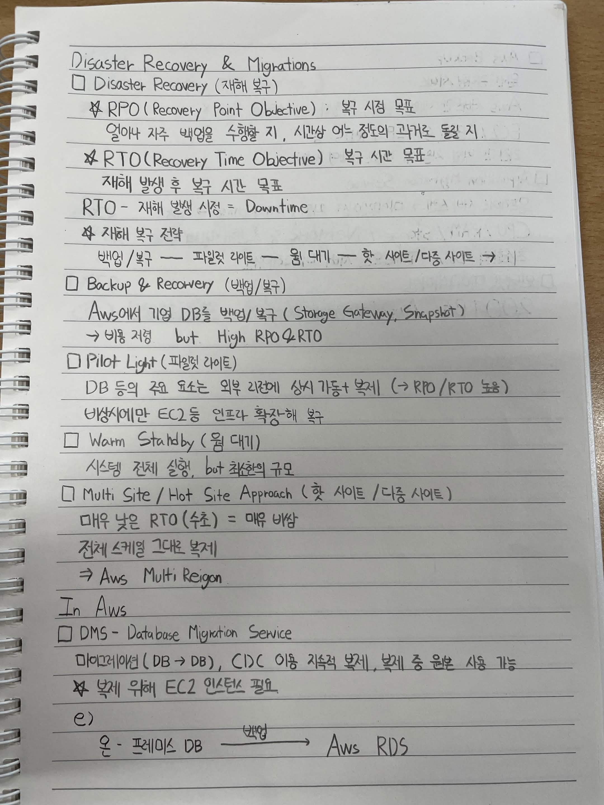
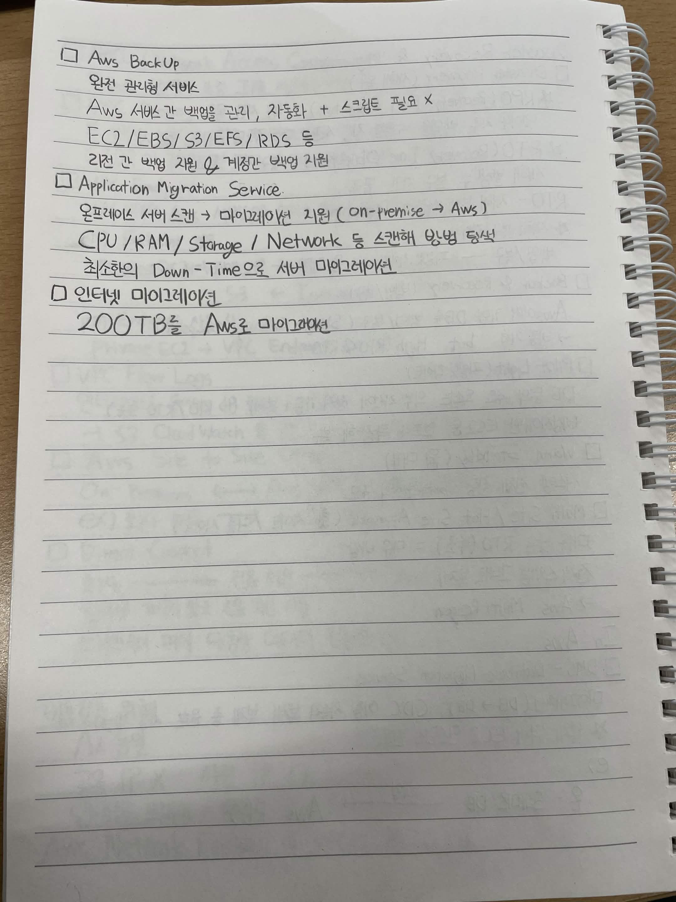

# Disaster Recovery & Migrations

## Disaster Recovery (재해 복구)

### RPO (Recovery Point Objective)
- 복구 시점 목표
- 얼마나 자주 백업을 수행할지
- 시간상 어느 정도의 과거로 돌릴지

### RTO (Recovery Time Objective)
- 복구 시간 목표
- 재해 발생 후 복구 시간 목표
- `RTO - 재해 발생 시점 = Downtime`

### 재해 복구 전략

백업/복구 → 파일럿 라이트 → 웜 대기 → 핫 사이트/다중 사이트

---

## Backup & Recovery (백업/복구)

- AWS에서 기업 DB를 백업/복구
  - Storage Gateway
  - Snapshot
- 비용 저렴
- But, High RPO & RTO

---

## Pilot Light (파일럿 라이트)

- DB 등의 주요 요소는 외부 리전에 상시 기동 + 복제
  - → RPO / RTO 높음
- 비상시에만 EC2 등 인프라 확장해 복구

---

## Warm Standby (웜 대기)

- 시스템 전체 실행
- But, 최소한의 규모

---

## Multi Site / Hot Site Approach (핫 사이트 / 다중 사이트)

- 매우 낮은 RTO (수초)
- 매우 비쌈
- 전체 스택 그대로 복제
- → AWS Multi-Region

---

# In AWS

## DMS - Database Migration Service

- 마이그레이션 (DB → DB)
- CDC 이용 지속적 복제
- 복제 중 운영 사용 가능
- 복제를 위해 EC2 인스턴스 필요

### 예시

온-프레미스 DB
→ **복제**
→ AWS RDS

---

## AWS Backup

- 완전 관리형 서비스
- AWS 서버 간 백업을 관리, 자동화
  - 스크립트 필요 X
- EC2 / EBS / S3 / EFS / RDS 등
- 리전 간 백업 지원 & 계정 간 백업 지원

---

## Application Migration Service

- 온프레미스 서버 스캔
  → 마이그레이션 지원 (On-premise → AWS)
- CPU / RAM / Storage / Network 등 스캔해 운영 방식 분석
- 최소한의 Down-Time으로 서버 마이그레이션

---

## 인터넷 마이그레이션

- 200TB를 AWS로 마이그레이션

