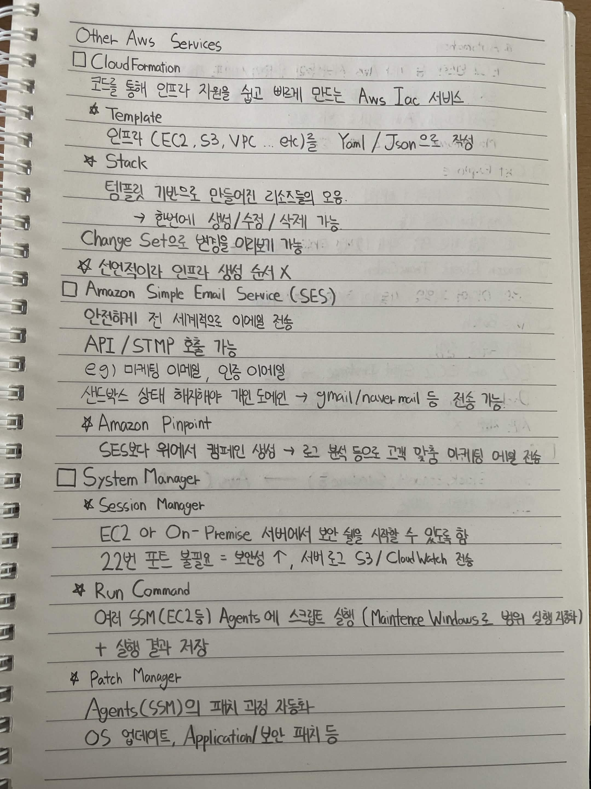
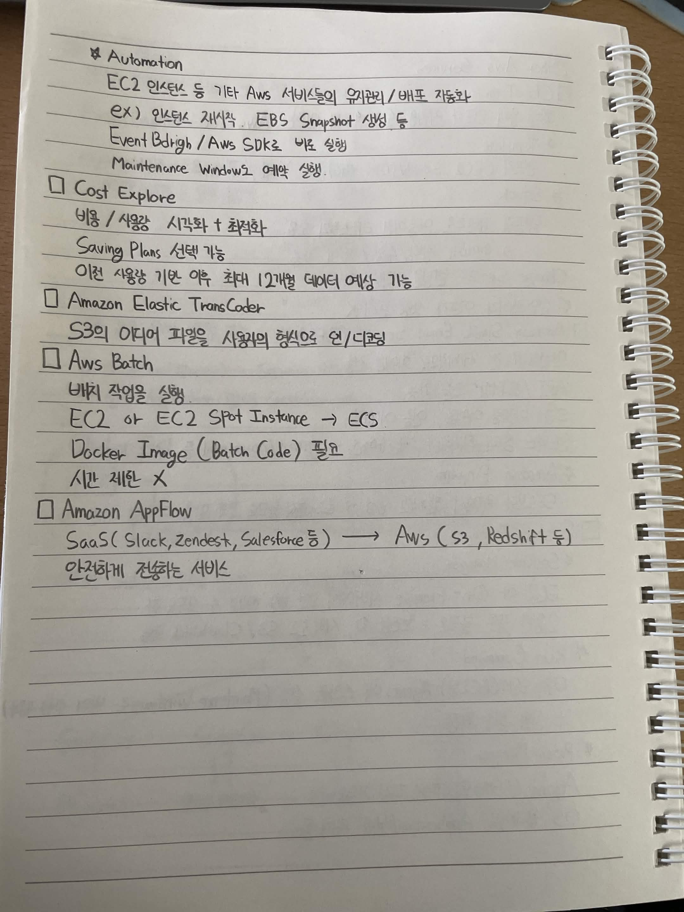

# Other AWS Services

## CloudFormation

코드를 통해 인프라 구축을 쉽고 빠르게 만드는 AWS IaC 서비스

### Template

인프라(EC2, S3, VPC 등)를 YAML / JSON으로 생성

### Stack

템플릿 기반으로 만들어진 리소스의 모음

한번에 생성 / 수정 / 삭제 가능

Change Set으로 변경 사항 미리보기 가능

선언적이라 인프라 생성 순서가 필요 없음

## Amazon Simple Email Service (SES)

안전하게 전 세계적으로 이메일 전송

API / SMTP 호출 가능

예시
마케팅 이메일
인증 이메일

샌드박스 상태에서는 제한이 있음
개인 도메인 인증 후 Gmail / Naver Mail 등으로 전송 가능

### Amazon Pinpoint

SES보다 위에서 캠페인 생성

로그 분석 등을 통해 고객 맞춤 마케팅 이메일 전송

## System Manager

### Session Manager

EC2 또는 On-Premise 서버에서 보안 쉘을 사용할 수 있도록 함

22번 포트 불필요
보안성 증가
서버 로그를 S3 / CloudWatch로 전송 가능

### Run Command

여러 SSM Agent가 설치된 EC2 등에 스크립트 실행

Maintenance Windows로 실행 범위와 시간을 설정할 수 있음

실행 결과 저장 가능

### Patch Manager

SSM Agent가 설치된 서버의 패치 과정 자동화

OS 업데이트
Application 보안 패치 등

## Automation

EC2 인스턴스 등 기타 AWS 서비스의 워크플로우 및 배포 자동화

예시
인스턴스 재시작
EBS Snapshot 생성 등

EventBridge / AWS SDK로 실행 가능

Maintenance Windows 예약 실행 가능

## Cost Explorer

비용 / 사용량 시각화 및 최적화

Saving Plans 선택 가능

이전 사용량을 기반으로 이후 최대 12개월의 비용 및 사용량 예상 가능

## Amazon Elastic Transcoder

S3의 미디어 파일을 시청에 적합한 형식으로 인코딩

## AWS Batch

배치 작업을 실행

EC2 또는 EC2 Spot Instance 기반으로 실행

ECS와 연계하여 사용

Docker Image 필요

시간 제한 없음

## Amazon AppFlow

SaaS 서비스와 AWS 서비스 간 데이터를 안전하게 전송

예시

Slack
Zendesk
Salesforce

에서

S3
Redshift

등으로 데이터 전송

