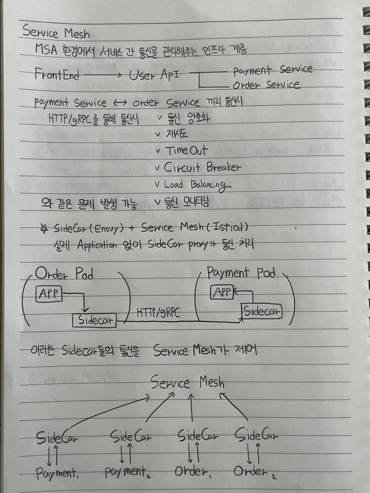

# Service Mesh

> MSA 환경에서 서비스 간 통신을 관리해주는 인프라 계층

```text
┌──────────┐
│ Frontend │
└────┬─────┘
     │
     ▼
┌──────────┐
│ User API │
└────┬─────┘
     │
     ├──────────────► ┌─────────────────┐
     │                │ Payment Service │
     │                └─────────────────┘
     │
     └──────────────► ┌─────────────────┐
                      │  Order Service  │
                      └─────────────────┘
```

### Payment Service ↔ Order Service 간 통신

HTTP/gRPC를 통해 통신

```text
┌─────────────────────────────────────┐
│          서비스 간 통신 문제         │
├─────────────────────────────────────┤
│                                     │
│  • 통신 암호화                      │
│  • 재시도                            │
│  • Timeout                          │
│  • Circuit Breaker                  │
│  • Load Balancing                   │
│  • 통신 모니터링                    │
│                                     │
└─────────────────────────────────────┘
```

이러한 문제를 **Application 코드에서 직접 처리하면 복잡해짐**

```text
┌──────────────────┐
│   Order Service  │
│                  │
│  Application     │
│  ┌────────────┐  │
│  │ 비즈니스   │  │
│  │ 로직       │  │
│  └────────────┘  │
│                  │
│  ┌────────────┐  │
│  │ Retry      │  │
│  │ Timeout    │  │
│  │ mTLS       │  │
│  │ Monitoring │  │
│  └────────────┘  │
└──────────────────┘

        ↓

서비스가 많아질수록
네트워크 관련 코드가
각 Application에 반복됨
```

### Sidecar(Envoy) + Service Mesh(Istiod)

> 실제 Application 코드 없이 **Sidecar Proxy가 통신 처리**

```text
┌────────────── Order Pod ──────────────┐
│                                       │
│  ┌─────────────┐    ┌─────────────┐  │
│  │ Application │───►│   Sidecar   │  │
│  │    (APP)     │    │   (Envoy)   │  │
│  └─────────────┘    └──────┬──────┘  │
│                             │         │
└─────────────────────────────┼─────────┘
                              │
                         HTTP / gRPC
                              │
                              ▼
┌────────────── Payment Pod ─────────────┐
│                                        │
│  ┌─────────────┐    ┌─────────────┐   │
│  │   Sidecar   │───►│ Application │   │
│  │   (Envoy)   │    │    (APP)     │   │
│  └─────────────┘    └─────────────┘   │
│                                        │
└────────────────────────────────────────┘
```

**Sidecar = Application 옆에 붙는 Proxy**

**Envoy = 실제 네트워크 통신을 처리하는 Proxy**

```text
        Order Pod                         Payment Pod

┌─────────────────────┐             ┌─────────────────────┐
│ APP ──► Envoy       │             │ Envoy ──► APP       │
└──────────┬──────────┘             └─────────▲───────────┘
           │                                  │
           └──────── HTTP / gRPC ─────────────┘
```

### Service Mesh

> 여러 Sidecar의 통신을 전체적으로 관리

```text
                         ┌─────────────────┐
                         │  Service Mesh   │
                         │    (Istiod)     │
                         │  Control Plane  │
                         └────────┬────────┘
                                  │
                       설정 / 정책 전달
                                  │
              ┌───────────────────┼───────────────────┐
              │                   │                   │
              ▼                   ▼                   ▼
      ┌─────────────┐     ┌─────────────┐     ┌─────────────┐
      │   Sidecar   │     │   Sidecar   │     │   Sidecar   │
      │   Envoy     │     │   Envoy     │     │   Envoy     │
      └──────┬──────┘     └──────┬──────┘     └──────┬──────┘
             │                   │                   │
             ▼                   ▼                   ▼
      ┌─────────────┐     ┌─────────────┐     ┌─────────────┐
      │  Payment₁   │     │  Payment₂   │     │   Order₁    │
      │     Pod     │     │     Pod     │     │     Pod     │
      └─────────────┘     └─────────────┘     └─────────────┘
```

### 핵심 정리

```text
┌──────────────────────────────────────────────┐
│                  Service Mesh                │
│                                              │
│  ┌──────────────┐                            │
│  │    Istiod    │  ← Control Plane           │
│  │              │                            │
│  │ 설정 / 정책  │                            │
│  └──────┬───────┘                            │
│         │                                    │
│         │ 설정 전달                          │
│         ▼                                    │
│  ┌──────────────┐                            │
│  │    Envoy     │  ← Data Plane              │
│  │              │                            │
│  │ 실제 트래픽  │                            │
│  │ 처리         │                            │
│  └──────────────┘                            │
│                                              │
└──────────────────────────────────────────────┘
```

