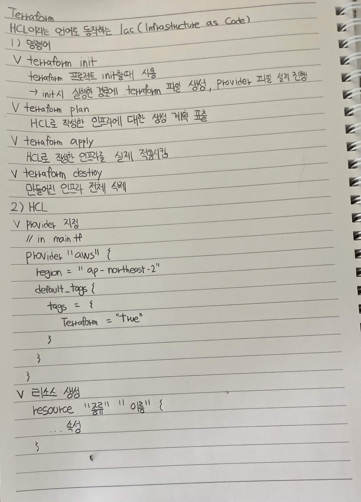

# Terraform

HCL이라는 언어로 동작하는 IaC (Infrastructure as Code)

## 1) 명령어

### `terraform init`

Terraform 프로젝트 초기화 때 사용

→ init 실행한 경로에 `.terraform` 파일 생성, provider 파일 설치 진행

### `terraform plan`

HCL로 작성한 인프라에 대한 생성 계획 표출

### `terraform apply`

HCL로 작성한 인프라를 실제 적용

### `terraform destroy`

만들어진 인프라 전체 삭제

---

## 2) HCL

### Provider 지정

```hcl
// in main.tf

provider "aws" {
  region = "ap-northeast-2"

  default_tags {
    tags = {
      Terraform = "true"
    }
  }
}
```

### 리소스 생성

```hcl
resource "종류" "이름" {
  ... 속성
}
```

