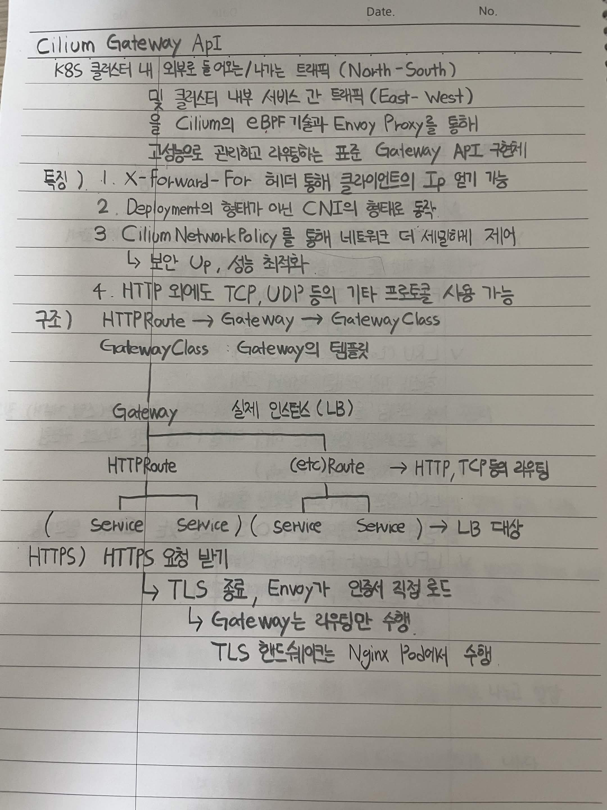

# Cilium Gateway API

K8S 클러스터 내 외부로 들어오는/나가는 트래픽 (North-South)
및 클러스터 내부 서비스 간 트래픽 (East-West)
을 Cilium의 eBPF 기술과 Envoy Proxy를 통해
고성능으로 관리하고 라우팅하는 표준 Gateway API 구현체

## 특징

1. `X-Forwarded-For` 헤더를 통해 클라이언트의 IP 얻기 가능
2. Deployment의 형태가 아닌 CNI의 형태로 동작
3. Cilium NetworkPolicy를 통해 네트워크를 더 세밀하게 제어

   * 보안 UP
   * 성능 최적화
4. HTTP 외에도 TCP, UDP 등의 기타 프로토콜 사용 가능

## 구조

```text
HTTPRoute → Gateway → GatewayClass
```

* `GatewayClass` : Gateway의 템플릿
* `Gateway` : 실제 인스턴스 (LB)

```text
                    Gateway
                       │
          ┌────────────┴────────────┐
          │                         │
     HTTPRoute                  (etc)Route
          │                         │
     ┌────┴────┐              ┌─────┴─────┐
     │         │              │           │
  Service   Service        Service     Service
     │         │              │           │
     └─────────┴──────────────┴───────────┘
                         ↓
                      LB 대상
```

`(etc)Route` → HTTP, TCP 등의 라우팅

## HTTPS

HTTPS 요청을 받은 뒤:

```text
HTTPS 요청
    ↓
TLS 종료
    ↓
Envoy가 인증서 직접 로드
    ↓
Gateway는 라우팅만 수행
```

* TLS 핸드셰이크는 Nginx Pod에서 수행


