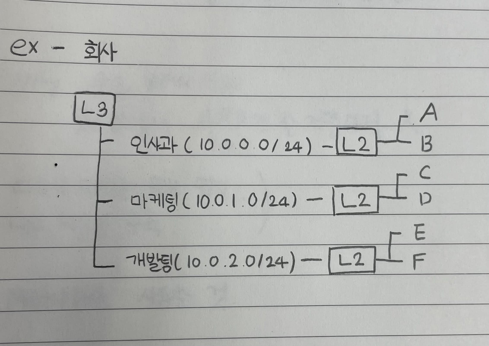

# L2 스위치 VS L3 스위치
- L2 스위치
	- MAC 주소 가지고 통신
	- LAN(동일 네트워크) 내부에서 통신
- L3 스위치
	- IP 주소를 가지고 통신
	- 서로 다른 네트워크와 통신(=라우팅)
  

- A, B 통신
	- 같은 네트워크 LAN이므로 L2 스위치를 활용해 통신
- A, F 통신
	- 다른 네트워크이므로 L3 스위치 -> L2 스위치를 활용해 통신
