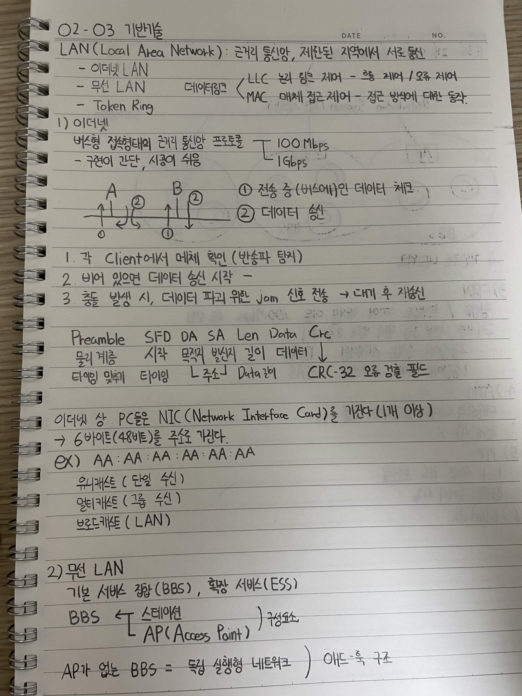
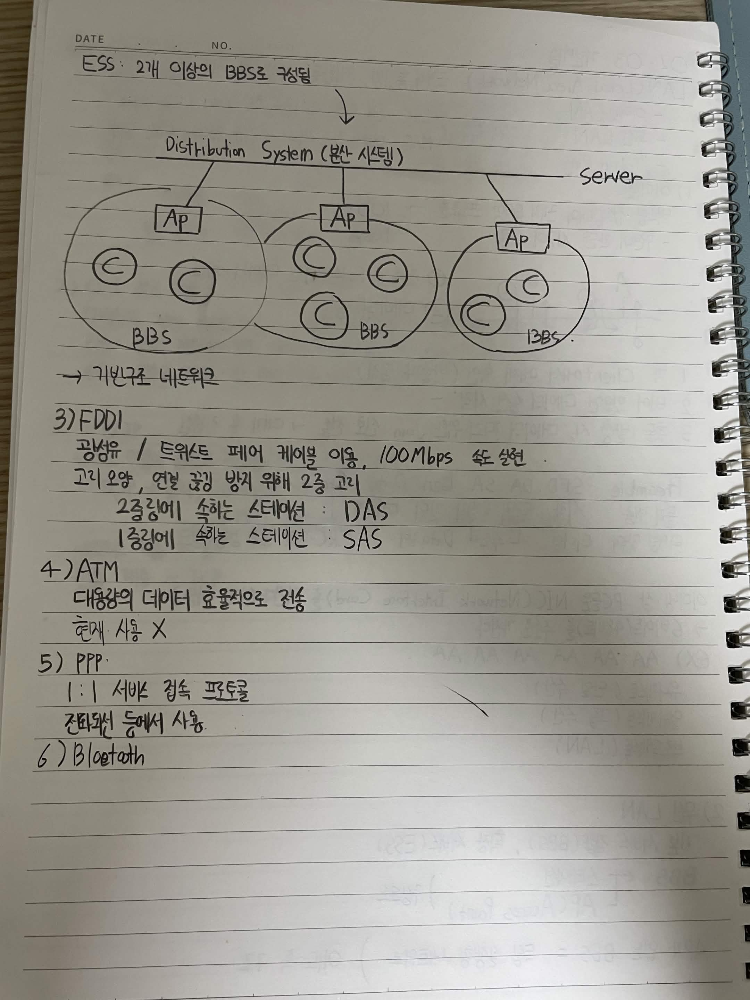

# 02-03 기반기술

## LAN (Local Area Network)

근거리 통신망, 제한된 지역에서 서로 통신

- 이더넷 LAN
- 무선 LAN
- Token Ring

### 데이터링크

- LLC: 논리 링크 제어 → 흐름 제어 / 오류 제어
- MAC: 매체 접근 제어 → 정해진 방식에 따른 동작

---

## 1) 이더넷

버스형 접속 형태의 근거리 통신 프로토콜

- 100 Mbps
- 1 Gbps
- 구현이 간단, 시공이 쉬움

### CSMA/CD 동작

1. 각 Client에서 매체 확인 (반송파 탐지)
2. 비어 있으면 데이터 송신 시작
3. 충돌 발생 시, 데이터 파괴를 위한 Jam 신호 전송 → 대기 후 재송신

### 이더넷 프레임

`Preamble | SFD | DA | SA | Len | Data | CRC`

- Preamble: 물리 계층 시작, 타이밍 맞추기
- SFD: 시작
- DA: 목적지 주소
- SA: 발신지 주소
- Len: 데이터 길이
- Data: 데이터
- CRC: CRC-32 오류 검출 필드

### MAC 주소

이더넷 상 PC들은 NIC(Network Interface Card)를 가지고 있음

- 6바이트(48비트)를 주소로 가짐
- 예: `AA:AA:AA:AA:AA:AA`

주소 종류:

- 유니캐스트: 단일 수신
- 멀티캐스트: 그룹 수신
- 브로드캐스트: LAN 전체

---

## 2) 무선 LAN

기본 서비스 집합(BSS), 확장 서비스(ESS)

### BSS

BSS는 다음으로 구성됨

- 스테이션
- AP (Access Point)

AP가 없는 BSS = **독립 실행형 네트워크**

---

## ESS

**ESS: 2개 이상의 BBS로 구성됨**

```text
                 Distribution System (분산 시스템)
                           │
              ┌────────────┼────────────┐
              │            │            │
             AP           AP           AP
              │            │            │
             BBS          BBS          BBS
           ○    ○       ○  ○  ○       ○    ○
```

→ 기본구조 네트워크

---

## 3) FDDI

- 광섬유 / 트위스트 페어 케이블 이용
- 100 Mbps 속도 실현
- 고리 모양
- 연결 끊김 방지를 위해 2중 고리 사용

### 이중 링 구조

- 2중 링에 속하는 스테이션: **DAS**
- 1중 링에 속하는 스테이션: **SAS**

---

## 4) ATM

- 대용량의 데이터를 효율적으로 전송
- 현재 사용 X

---

## 5) PPP

- 1:1 서버 접속 프로토콜
- 전화선 등에서 사용

---


