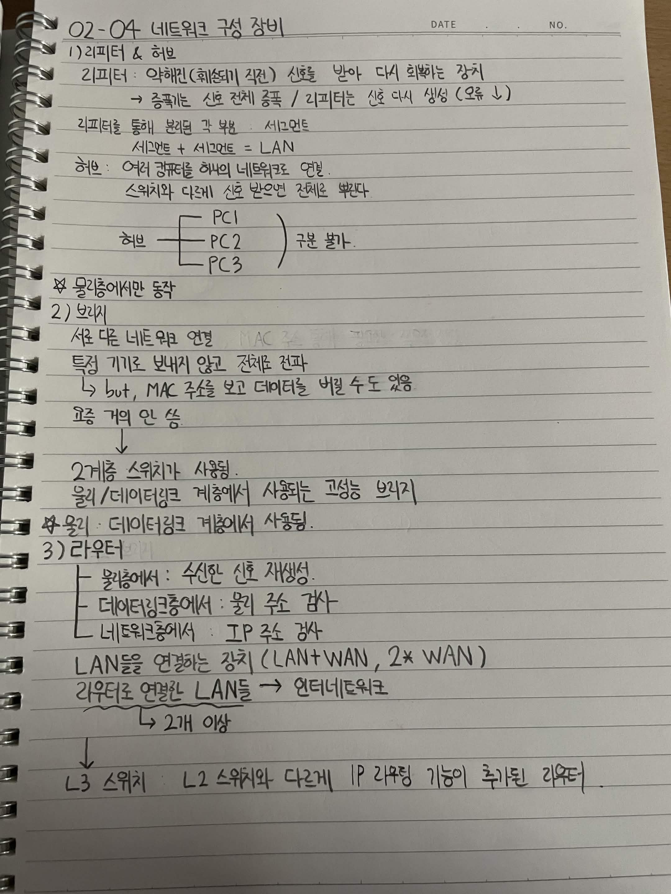

# 02-04 네트워크 구성 장비

## 1) 리피터 & 허브

### 리피터

* 약해진 (훼손되기 직전) 신호를 받아 다시 회복하는 장치
* 증폭기는 신호 전체 증폭 / 리피터는 신호 다시 생성 (오류 ↓)
* 리피터를 통해 분리된 각 부분 → 세그먼트
* 세그먼트 + 세그먼트 = LAN

### 허브

* 여러 컴퓨터를 하나의 네트워크로 연결
* 스위치와 다르게 신호 받으면 전체로 뿌린다.

```text
허브 ─┬─ PC1
      ├─ PC2
      └─ PC3
          ) 구분 불가
```

* 물리층에서만 동작

---

## 2) 브리지

* 서로 다른 네트워크 연결
* 특정 기기로 보내지 않고 전체로 전파

  * but, MAC 주소를 보고 데이터를 버릴 수도 있음
* 요즘 거의 안 씀
* ↓
* 2계층 스위치가 사용됨
* 물리/데이터링크 계층에서 사용되는 고성능 브리지
* 물리/데이터링크 계층에서 사용됨

---

## 3) 라우터

* 물리층에서: 수신된 신호 재생성

* 데이터링크층에서: 물리 주소 검사

* 네트워크층에서: IP 주소 검사

* LAN들을 연결하는 장치 (LAN+WAN, 2× WAN)

* 라우터로 연결된 LAN들 → 인터네트워크

  * 2개 이상

↓

**L3 스위치**

* L2 스위치와 다르게 IP 라우팅 기능이 추가된 라우터


