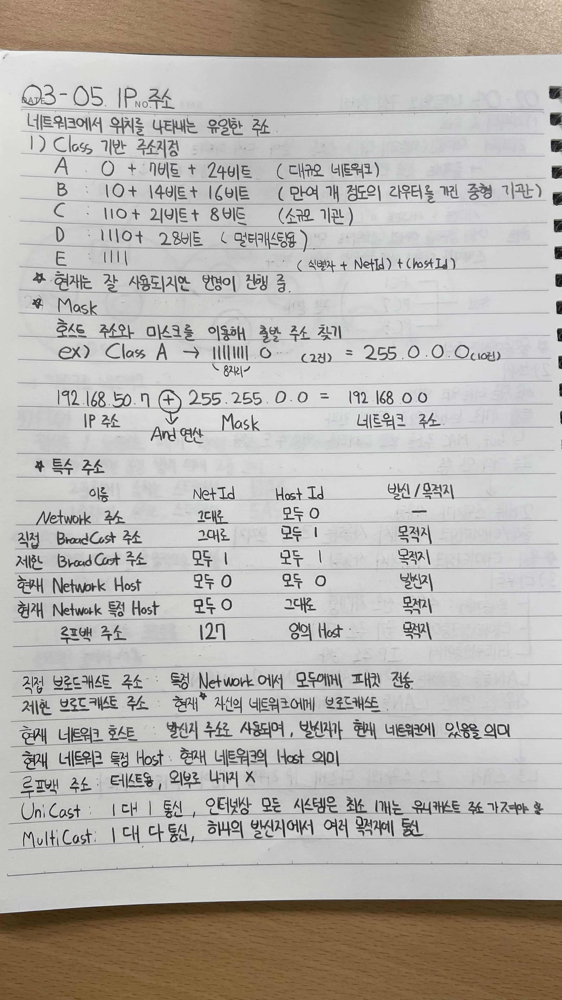
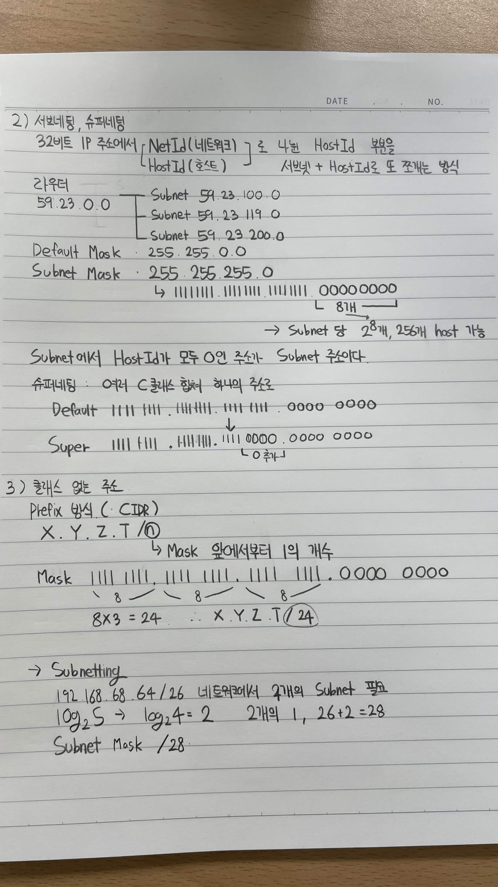

# 03-05. IP 주소

## IP 주소

네트워크에서 위치를 나타내는 유일한 주소

### 1) Class 기반 주소체계

* **A Class** : `0 + 7비트 + 24비트`
  → 대규모 네트워크

* **B Class** : `10 + 14비트 + 16비트`
  → 만여 개 정도의 라우터를 가진 중형 기관

* **C Class** : `110 + 21비트 + 8비트`
  → 소규모 기관

* **D Class** : `1110 + 28비트`
  → 멀티캐스팅

* **E Class** : `1111`
  → 실험용

> 현재는 잘 사용되지만, 범용이 진행 중

---

## Mask

호스트 주소와 마스크를 이용해 **로컬 주소 찾기**

### 예시

Class A

`11111111.0...`

→ 앞의 8비트가 `1`

`255.0.0.0`

### AND 연산

`192.168.50.7 AND 255.255.0.0 = 192.168.0.0`

* IP 주소: `192.168.50.7`
* Mask: `255.255.0.0`
* 네트워크 주소: `192.168.0.0`

---

## 특수 주소

| 이름                 | NetId | HostId   | 발신 / 목적지 |
| ------------------ | ----- | -------- | -------- |
| Network 주소         | 그대로   | 모두 0     | -        |
| 직접 Broadcast 주소    | 그대로   | 모두 1     | 목적지      |
| 제한 Broadcast 주소    | 모두 1  | 모두 1     | 목적지      |
| 현재 Network Host    | 모두 0  | 모두 0     | 발신지      |
| 현재 Network 특정 Host | 모두 0  | 그대로      | 목적지      |
| 루프백 주소             | 127   | 임의의 Host | 목적지      |

### 직접 브로드캐스트 주소

특정 Network에서 모두에게 패킷 전송

### 제한 브로드캐스트 주소

현재 자신이 속한 네트워크에 브로드캐스트

### 현재 네트워크 호스트

발신지 주소로 사용되며, 발신자가 현재 네트워크에 있음을 의미

### 현재 네트워크 특정 Host

현재 네트워크의 Host 의미

### 루프백 주소

테스트용, 외부로 나가지 X

### Unicast

1대 1 통신

인터넷상 모든 시스템은 최소 1개는 유니캐스트 주소를 가져야 함

### Multicast

1대 다 통신, 하나의 발신지에서 여러 목적지에 전송

---

# 2) 서브네팅, 슈퍼네팅

## 서브네팅

32비트 IP 주소에서

* `NetId` (네트워크)
* `HostId` (호스트)

로 나눈 뒤, **4분할**

→ 서브넷 + HostId로도 쪼개는 방식

### 예시

라우터

* Subnet `59.23.100.0`
* Subnet `59.23.119.0`
* Subnet `59.23.200.0`

**Default Mask**

`255.255.0.0`

**Subnet Mask**

`255.255.255.0`

`11111111.11111111.11111111.00000000`

→ 마지막 `8비트`를 사용

→ Subnet당 `2⁸개 = 256개 Host` 가능

> Subnet에서 HostId가 모두 `0`인 곳은 Subnet 주소이다.

---

## 슈퍼네팅

여러 C클래스 범위를 합쳐 **하나의 주소**로 만드는 것

### Default

`11111111.11111111.11111111.00000000`

### Super

`11111111.11111111.11110000.00000000`

→ 네트워크 비트를 줄이고 Host 비트를 늘려 여러 네트워크를 하나로 합침

---

# 3) 클래스 없는 주소

## Prefix 방식 (CIDR)

`X.Y.Z.T/①`

→ Mask 앞에서부터 `1`의 개수

### 예시

Mask

`11111111.11111111.11111111.00000000`

각 옥텟의 앞부분이 각각 8비트이므로

`8 × 3 = 24`

∴ `X.Y.Z.T/24`

---

## Subnetting

`192.168.68.64/26` 네트워크에서 **4개의 Subnet** 필요

`log₂4 = 2`

→ 2개의 비트를 `1`로 추가

`26 + 2 = 28`

∴ **Subnet Mask `/28`**

