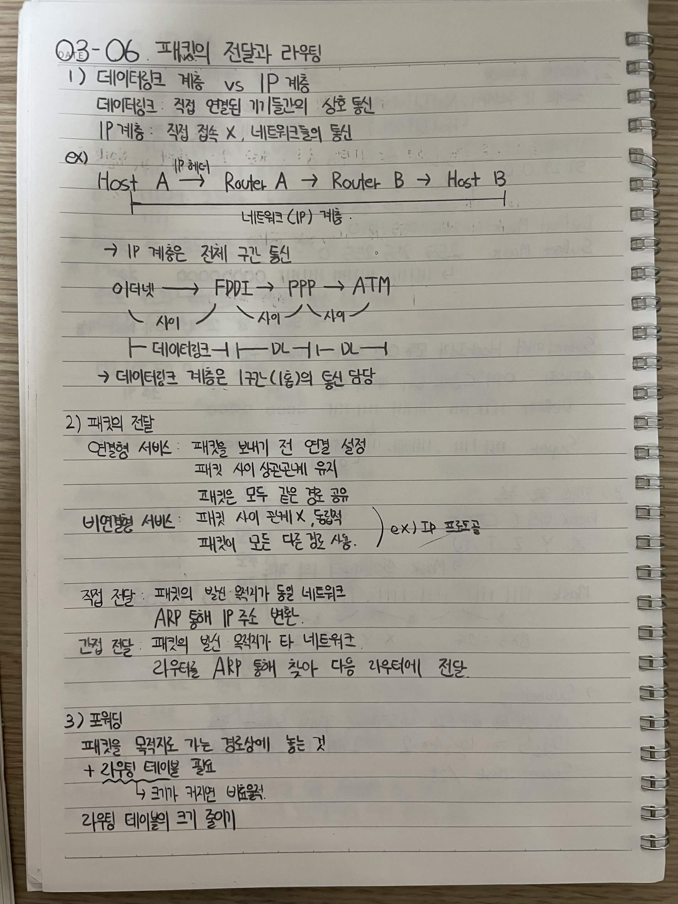
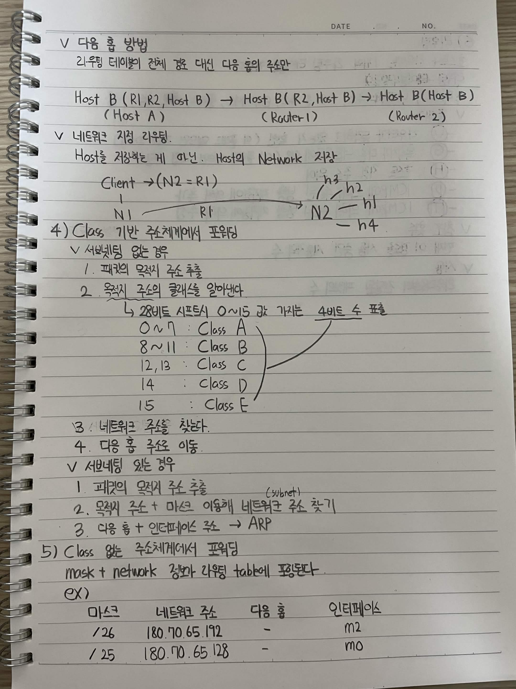
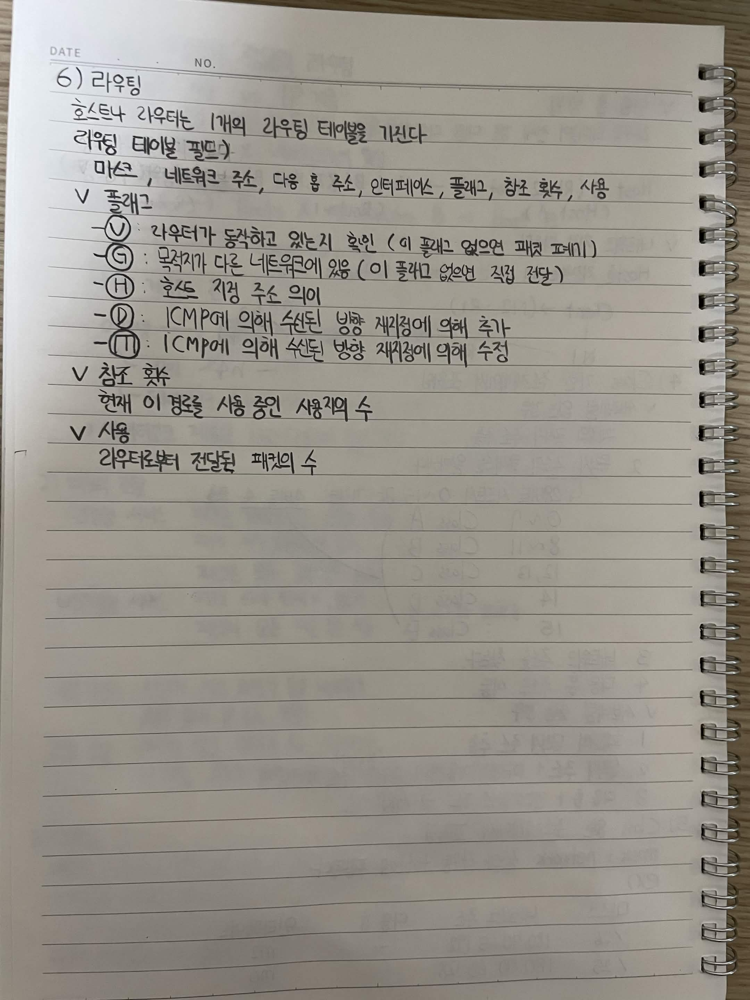

# 03-06. 패킷의 전달과 라우팅

## 1) 데이터링크 계층 vs IP 계층

데이터링크: 직접 연결된 기기들의 상호 통신

IP 계층: 직접 접속 X, 네트워크들의 통신

ex)

Host A → Router A → Router B → Host B

→ IP 계층은 전체 구간 통신

이더넷 → FDDI → PPP → ATM

→ 데이터링크 계층은 1구간(1홉)의 통신 담당

## 2) 패킷의 전달

### 연결형 서비스

- 패킷을 보내기 전 연결 설정
- 패킷 사이 상관관계 유지
- 패킷은 모두 같은 경로 공유

### 비연결형 서비스

- 패킷 사이 관계 X, 독립적
- 패킷이 모두 다른 경로 사용
- ex) IP 프로토콜

### 직접 전달

패킷의 발신 목적지가 동일 네트워크

ARP 통해 IP 주소 변환

### 간접 전달

패킷의 발신 목적지가 타 네트워크

라우터를 ARP 통해 찾아 다음 라우터에 전달

## 3) 포워딩

패킷을 목적지로 가는 경로상에 놓는 것

+ 라우팅 테이블 필요

→ 크기가 커지면 비효율

라우팅 테이블의 크기 줄이기

### 다음 홉 방법

라우팅 테이블 전체 경로 대신 다음 홉 주소만

Host B (R1, R2, Host B) → Host B (R2, Host B) → Host B (Host B)

(Host A)　　　　　　　　　(Router 1)　　　(Router 2)

### 네트워크 지정 라우팅

Host를 지정하는 게 아닌, Host의 Network 지정

Client → (N2 = R1)

N1 → R1 → N2

## 4) Class 기반 주소체계에서 포워딩

### 서브넷팅 없는 경우

1. 패킷의 목적지 주소 추출
2. 목적지 주소의 클래스를 알아낸다.
   - 28비트 시스템이 0~15 값을 가지는 4비트 수 표현
   - 0~7 : Class A
   - 8~11 : Class B
   - 12, 13 : Class C
   - 14 : Class D
   - 15 : Class E
3. 네트워크 주소를 찾는다.
4. 다음 홉 주소 이동

### 서브넷팅 있는 경우

1. 패킷의 목적지 주소 추출
2. 목적지 주소 + 마스크 이용해 네트워크 주소 찾기 (subnet)
3. 다음 홉 + 인터페이스 주소 → ARP

## 5) Class 없는 주소체계에서 포워딩

mask + network 정보가 라우팅 테이블에 포함된다.

ex)

| 마스크 | 네트워크 주소 | 다음 홉 | 인터페이스 |
|---|---|---|---|
| /26 | 180.70.65.192 | - | m2 |
| /25 | 180.70.65.128 | - | m0 |

## 6) 라우팅

호스트나 라우터는 1개의 라우팅 테이블을 가진다

라우팅 테이블 필드:
- 마스크
- 네트워크 주소
- 다음 홉 주소
- 인터페이스
- 플래그
- 참조 횟수
- 사용

### 플래그

- **U** : 라우터가 동작하고 있는지 확인 (이 플래그 없으면 패킷 폐기)
- **G** : 목적지가 다른 네트워크에 있음 (이 플래그 없으면 직접 전달)
- **H** : 호스트 지정 주소 외
- **D** : ICMP에 의해 선택된 방향 재지정에 의해 추가
- **M** : ICMP에 의해 선택된 방향 재지정에 의해 수정

### 참조 횟수

현재 이 경로를 사용 중인 사용자 수

### 사용

라우터로부터 전달된 패킷 수

