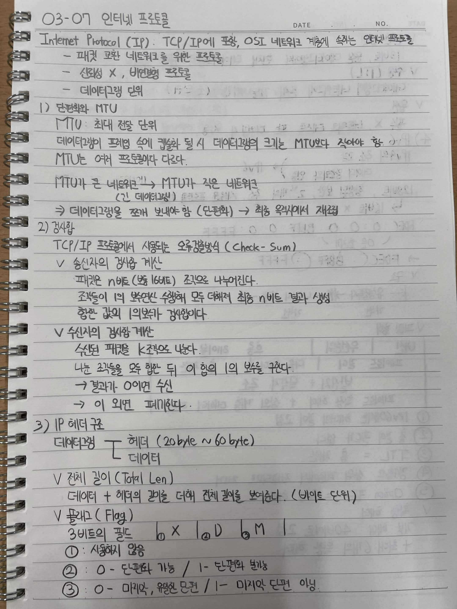
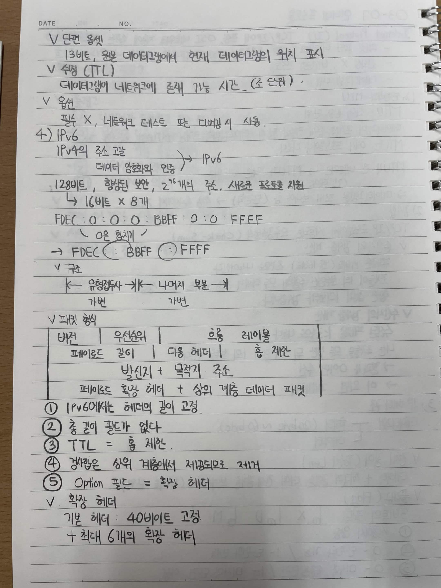

# 03-07 인터넷 프로토콜

## Internet Protocol (IP)

TCP/IP에 포함, OSI 네트워크 계층에 속하는 인터넷 프로토콜

* 패킷 교환 네트워크를 위한 프로토콜
* 신뢰성 X, 비연결형 프로토콜
* 데이터그램 단위

## 1) 단편화와 MTU

**MTU:** 최대 전송 단위

데이터그램이 프레임 속에 캡슐화 될 시 데이터그램의 크기는 MTU보다 작아야 함.

* MTU는 여러 프로토콜마다 다르다.
* MTU가 큰 네트워크 → MTU가 작은 네트워크 (긴 데이터그램)
* 데이터그램을 쪼개 보내야 함 (단편화) → 최종 목적지에서 재조립

### 단편화 관련 필드

* **단편 오프셋**

  * 13비트
  * 원본 데이터그램에서 현재 데이터그램의 위치 표시

* **수명 (TTL)**

  * 데이터그램이 네트워크에 존재 가능한 시간 (초 단위)

* **옵션**

  * 필수 X, 네트워크 테스트 또는 디버깅 시 사용

## 2) 검사합

TCP/IP 프로토콜에서 사용되는 오류검출 (Check-Sum)

### 송신자의 검사합 계산

* 패킷은 n비트 (보통 16비트) 조각으로 나누어진다.
* 조각들이 1의 보수 연산해 모두 더해져 최종 n비트 결과 생성
* 합한 값의 1의 보수가 검사합이다.

### 수신자의 검사합 계산

* 수신된 패킷을 k조각으로 나눈다.
* 나눈 조각들을 모두 합한 뒤 이 합의 1의 보수를 구한다.
* 결과가 `0`이면 수신
* 이 외면 폐기

## 3) IP 헤더 구조

데이터그램

* 헤더 (20byte ~ 60byte)
* 데이터

### 전체 길이 (Total Len)

데이터 + 헤더의 길이를 더해 전체 길이를 보여준다. (바이트 단위)

### 플래그 (Flag)

3비트의 필드

`① X | ② D | ③ M`

* **①:** 사용하지 않음
* **②:** `0` - 단편화 가능 / `1` - 단편화 불가능
* **③:** `0` - 마지막, 유일한 단편 / `1` - 마지막 단편 아님

## 4) IPv6

* IPv4의 주소 고갈
* 데이터 암호화와 인증 → IPv6
* 128비트
* 향상된 보안
* `2^96`개의 주소
* 새로운 프로토콜 지원
* `16비트 × 8개`

### IPv6 주소

`FDEC:0:0:BBFF:0:0:FFFF`

* `0`은 생략 가능

→ `FDEC::BBFF::FFFF`

### 구조

`<앞부분> + <나머지 부분>`

### 패킷 형식

| 버전                        | 우선순위  | 흐름 레이블 |
| ------------------------- | ----- | ------ |
| 페이로드 길이                   | 다음 헤더 | 홉 제한   |
| 발신지 + 목적지 주소              |       |        |
| 페이로드 확장 헤더 + 상위 계층 데이터 패킷 |       |        |

1. IPv6에서는 헤더의 길이 고정
2. 총 길이 필드가 없다
3. TTL = 홉 제한
4. 확장옵션은 상위 계층에서 체계적으로 제거
5. Option 필드 = 확장 헤더

### 확장 헤더

* 기본 헤더: **40바이트 고정**
* 최대 6개의 확장 헤더

