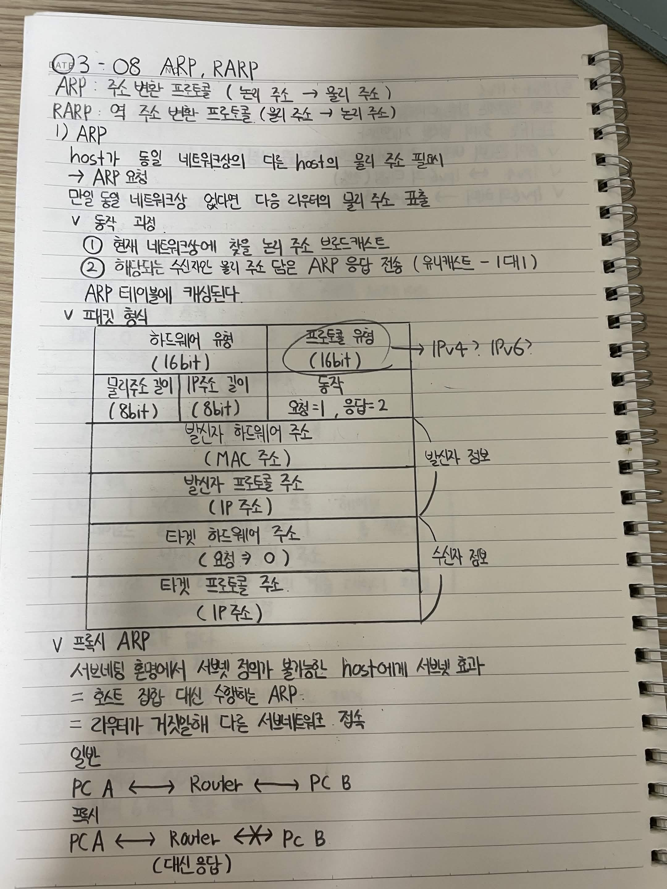
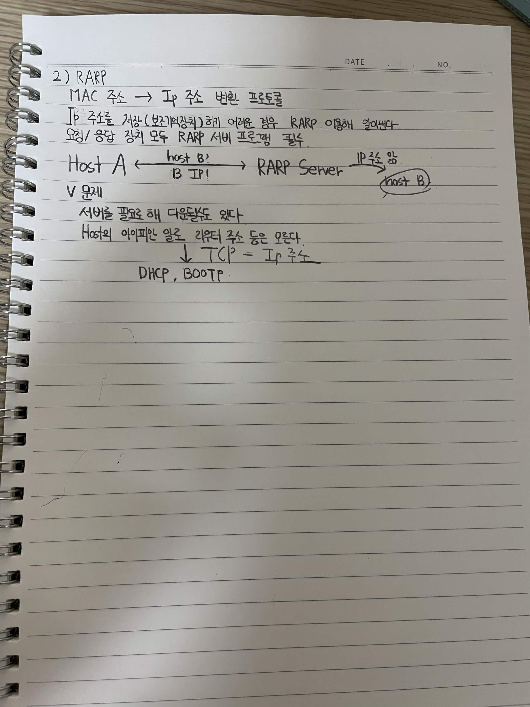

# ARP, RARP

## ARP, RARP

- **ARP**: 주소 변환 프로토콜 (논리 주소 → 물리 주소)
- **RARP**: 역 주소 변환 프로토콜 (물리 주소 → 논리 주소)

### 1) ARP

host가 동일 네트워크상의 다른 host의 물리 주소를 알기 위해 ARP 요청을 보냄.

- 동일 네트워크상에 없다면 다음 라우터의 물리 주소를 찾음

#### 동작 과정

1. 현재 네트워크에 찾을 논리 주소 브로드캐스트
2. 해당되는 수신자는 물리 주소 담은 ARP 응답 전송 (유니캐스트 - 1대1)
3. ARP 테이블에 캐싱됨

#### 패킷 형식

| 하드웨어 유형 (16bit) | 프로토콜 유형 (16bit) |
|---|---|
| 길이 (8bit) | 길이 (8bit) |
| **하드웨어 주소 (MAC 주소)** | |
| **발신자 프로토콜 주소 (IP 주소)** | |
| **타겟 하드웨어 주소 (요청 → 0)** | |
| **타겟 프로토콜 주소 (IP 주소)** | |

- 하드웨어 유형: 16bit
- 프로토콜 유형: 16bit
- 길이: 각각 8bit
- 동작: 요청 = 1, 응답 = 2
- 발신자 정보: MAC 주소, IP 주소
- 수신자 정보: MAC 주소, IP 주소

### 2) 프록시 ARP

서브넷팅 환경에서 서브넷 정의가 불가능한 host에게 서브넷 효과를 줌.

- 호스트 입장 대신 수행하는 ARP
- 라우터가 거짓말해 다른 서브넷으로 접속

일반:

`PC A ↔ Router ↔ PC B`

프록시:

`PC A ↔ Router ↔ PC B`

- Router가 PC B 대신 응답

### 3) RARP

**MAC 주소 → IP 주소** 변환 프로토콜

IP 주소를 저장(보지않음)하기 어려운 경우 RARP 이용해 알아냄.

- 요청/응답 장치 모두 RARP 서버 프로그램 필요

```text
Host A  ←→  RARP Server
              ↓
           IP 주소를 앎
              ↓
            Host B
```

#### 문제

- 서버를 필요로 해 다운로드도 있다.
- Host의 아이피만 알고 라우터 주소 등은 모름
- TCP/IP = IP 주소

이를 해결하기 위해 **DHCP, BOOTP** 등을 사용



