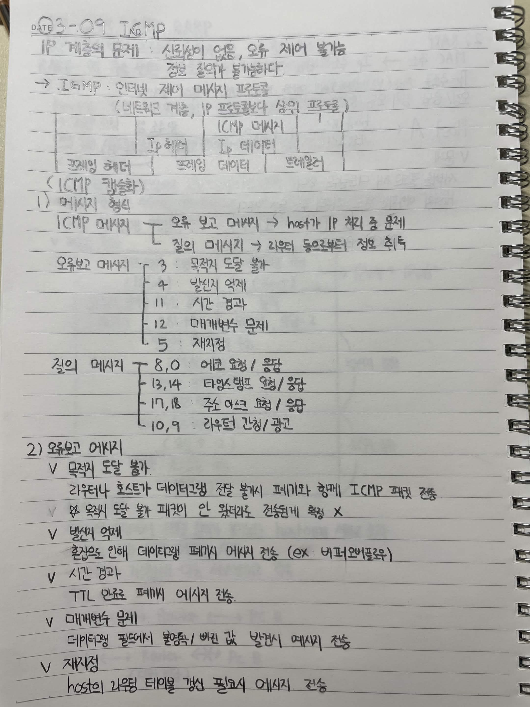
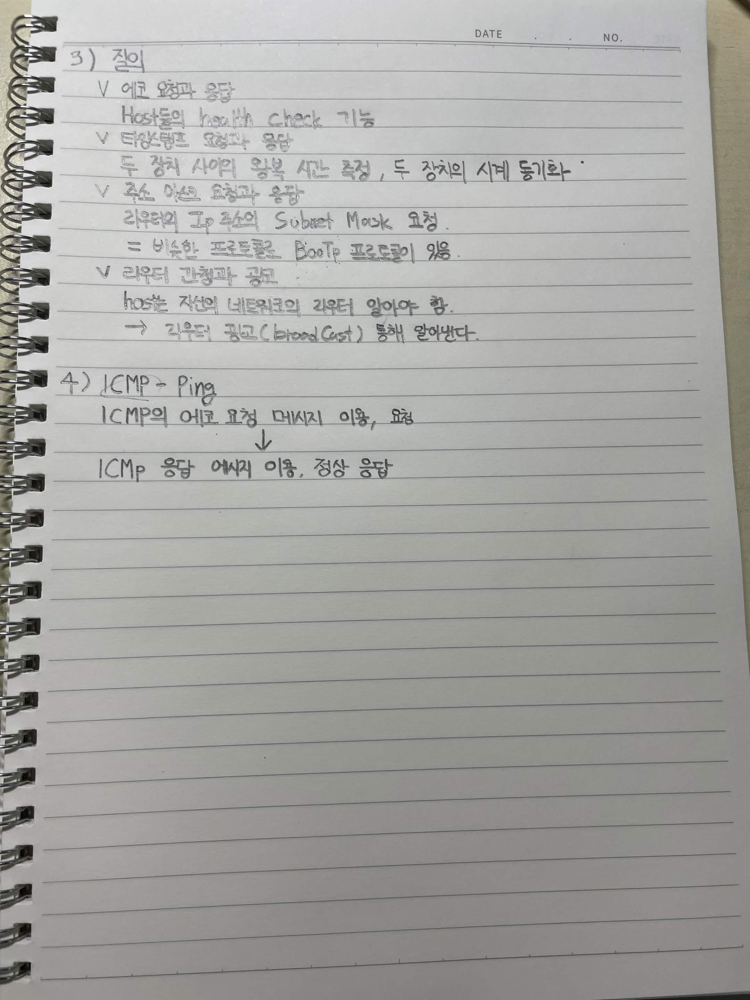

# 3-09 ICMP

## IP 계층의 문제

신뢰성이 없음, 오류 제어 불가능
정보 전달 불가능하다.

ICMP: 인터넷 제어 메시지 프로토콜
네트워크 계층, IP 프로토콜과 상위 프로토콜

## ICMP 메시지

IP 헤더
IP 데이터

ICMP 헤더
ICMP 데이터
트레일러

## 1) 메시지 형식

ICMP 메시지

오류 보고 메시지
host가 IP 처리 중 문제

질의 메시지
라우터 등으로부터 정보 취득

### 오류보고 메시지

3: 목적지 도달 불가

4: 발신지 억제

11: 시간 경과

12: 매개변수 문제

5: 재지정

### 질의 메시지

8, 0: 에코 요청 / 응답

13, 14: 타임스탬프 요청 / 응답

17, 18: 주소 마스크 요청 / 응답

10, 9: 라우터 간청 / 광고

## 2) 오류보고 메시지

목적지 도달 불가

라우터나 호스트가 데이터그램 전달 불가시 폐기와 함께 ICMP 패킷 전송

목적지 도달 불가 패킷이 안 왔더라도 전송하게 알려 X

발신지 억제

혼잡으로 인해 데이터그램 폐기시 억제 메시지 전송
ex. 버퍼오버플로우

시간 경과

TTL 만료로 폐기시 메시지 전송

매개변수 문제

데이터그램 필드에서 불량값 / 빠진 값 발견시 메시지 전송

재지정

host의 라우팅 테이블 갱신 필요시 메시지 전송

# 3) 질의

에코 요청과 응답

Host의 health check 기능

타임스탬프 요청과 응답

두 장치 사이의 왕복 시간 측정, 두 장치의 시계 동기화

주소 마스크 요청과 응답

라우터의 IP 주소의 Subnet Mask 요청

비슷한 프로토콜로 BootP 프로토콜이 있음.

라우터 간청과 광고

host는 자신의 네트워크의 라우터 알아야 함.

라우터 광고(Router Cost) 통해 알려준다.

# 4) ICMP - Ping

ICMP의 에코 요청 메시지 이용, 요청

ICMP 응답 에코 이용, 정상 응답

