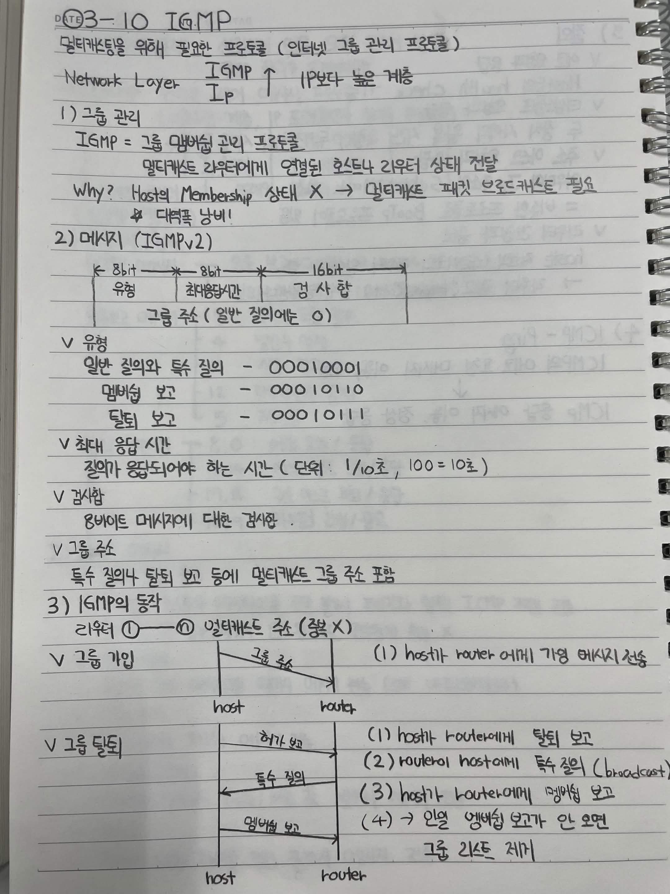
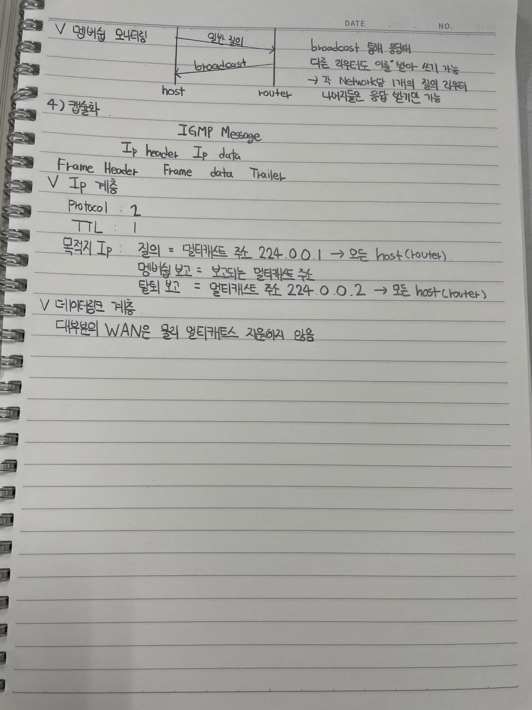

# 2026-03-10 IGMP

멀티캐스팅을 위해 필요한 프로토콜 (인터넷 그룹 관리 프로토콜)

> Network Layer
> IGMP ↑ IP보다 높은 계층

## 1. 그룹 관리

**IGMP = 그룹 멤버십 관리 프로토콜**

멀티캐스트 라우터에게 연결된 호스트나 라우터 상태 전달

**Why?** Host의 Membership 상태 X
→ 멀티캐스트 패킷 브로드캐스트 필요
→ 대역폭 낭비!

## 2. 메시지 (IGMPv2)

### 메시지 구조

| 8bit | 8bit              | 16bit |
| ---- | ----------------- | ----- |
| 유형   | 최대응답시간            | 검사합   |
|      | 그룹 주소 (일반 질의에는 0) |       |

### 유형

* 일반 질의와 특수 질의: `00010001`
* 멤버십 보고: `00010110`
* 탈퇴 보고: `00010111`

### 최대 응답 시간

질의가 응답되어야 하는 시간
단위: `1/10초`
`100 = 10초`

### 검사합

8바이트 메시지에 대한 검사합

### 그룹 주소

특수 질의나 탈퇴 보고 등에 멀티캐스트 그룹 주소 포함

---

## 3. IGMP의 동작

라우터 ① — ⑩ 이더넷 주소 (중복 X)

### 그룹 가입

```text
host                         router
  │                            │
  │──────── 그룹 주소 ─────────→│
  │                            │
  │  (1) host가 router에게 가입 메시지 전송
```

### 그룹 탈퇴

```text
host                         router
  │                            │
  │───────── 탈퇴 보고 ────────→│
  │                            │
  │←──────── 특수 질의 ─────────│
  │                            │
  │──────── 멤버십 보고 ───────→│
```

1. host → router에게 탈퇴 보고
2. router → host에게 특수 질의 (broadcast)
3. host → router에게 멤버십 보고
4. → 일정 멤버십 보고가 안 오면 그룹 리스트 제거

### 멤버십 모니터링

```text
host                         router
  │                            │
  │────────── 일반 질의 ───────→│
  │                            │
  │←────────── broadcast ──────│
```

* broadcast 통해 응답해 다른 라우터도 이를 받아 쓰기 가능
* 각 Networking 내의 1개의 질의 라우터
* 나머지들은 응답 멤버는 가능

---

## 4. 캡슐화

```text
Frame Header | IP Header | IP data | Trailer
                         └── IGMP Message
```

### IP 계층

* Protocol: `2`
* TTL: `1`
* 목적지 IP

  * 질의: 멀티캐스트 주소 `224.0.0.1` → 모든 host(router)
  * 멤버십 보고: 보고되는 멀티캐스트 주소
  * 탈퇴 보고: 멀티캐스트 주소 `224.0.0.2` → 모든 host(router)

### 네트워크 계층

대부분의 WAN은 물리 멀티캐스트 지원하지 않음



