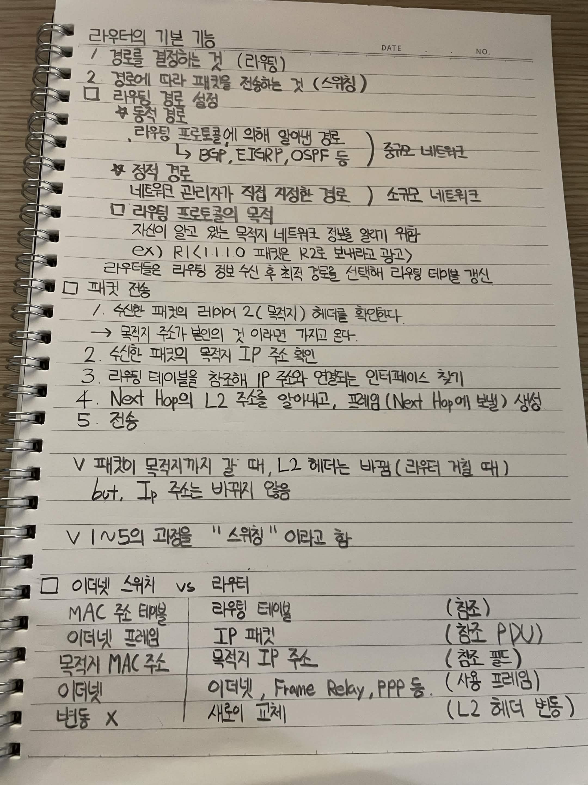

# 라우터의 기본 기능

1. 경로를 결정하는 것
   라우팅

2. 경로에 따라 패킷을 전송하는 것
   스위칭

## 라우팅 경로 설정

### 동적 경로

라우팅 프로토콜에 의해 알아내는 경로

BGP, EIGRP, OSPF 등

중규모 네트워크

### 정적 경로

네트워크 관리자가 직접 지정한 경로

소규모 네트워크

## 라우팅 프로토콜의 목적

자신이 알고 있는 목적지 네트워크 정보를 알리기 위함

예시

R1이 1.1.1.0 패킷은 R2로 보내라고 광고

라우터들은 라우팅 정보 수신 후 최적 경로를 선택하여 라우팅 테이블 갱신

# 패킷 전송

1. 수신한 패킷의 레이어 2 목적지 헤더를 확인한다

   목적지 주소가 본인의 것이 아니라면 가지고 온다

2. 수신한 패킷의 목적지 IP 주소 확인

3. 라우팅 테이블을 참조해 IP 주소와 연결되는 인터페이스 찾기

4. Next Hop의 L2 주소를 알아내고 프레임을 생성

   Next Hop에 보낼 프레임 생성

5. 전송

패킷이 목적지까지 갈 때 L2 헤더는 바뀐다

라우터를 거칠 때마다 L2 헤더가 변경됨

하지만 IP 주소는 바뀌지 않음

L1에서의 과정을 스위칭이라고 함

# 이더넷 스위치 vs 라우터

| 이더넷 스위치    | 라우터                     |
| ---------- | ----------------------- |
| MAC 주소 테이블 | 라우팅 테이블                 |
| 이더넷 프레임    | IP 패킷                   |
| 목적지 MAC 주소 | 목적지 IP 주소               |
| 이더넷        | 이더넷, Frame Relay, PPP 등 |
| 변동 없음      | 새로운 교체                  |

참고

스위치의 경우 MAC 주소 테이블을 참조함

라우터의 경우 라우팅 테이블을 참조함

이더넷 프레임은 L2 PDU

IP 패킷은 L3 PDU

목적지 MAC 주소는 목적지 IP 주소에 해당하는 L2 주소

라우터는 사용하는 프레임에 따라 L2 헤더가 변동됨

