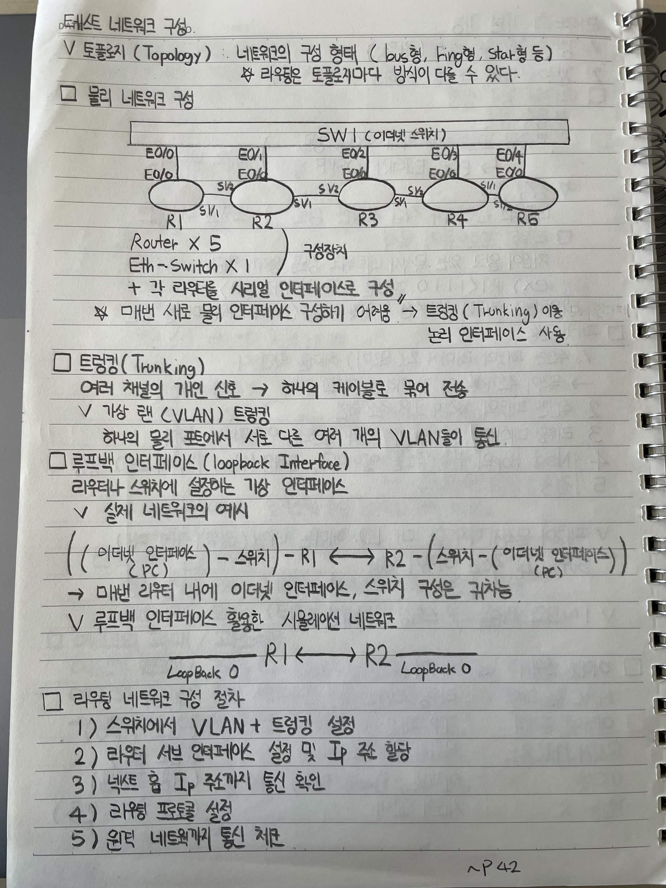

# 네트워크 구성

## 토폴로지 (Topology)

네트워크의 구성 형태
→ Bus형, Ring형, Star형 등

* 라우팅은 토폴로지마다 방식이 다를 수 있다.

## 물리 네트워크 구성

```text
                  ┌──────────── SW1 (이더넷 스위치) ────────────┐
                  │          │          │          │          │
                 E0/0       E0/1       E0/2       E0/3       E0/4
                  │          │          │          │          │
                 E0/0       E0/0       E0/0       E0/6       E0/0
                  R1 ─────── R2 ─────── R3 ─────── R4 ─────── R5
                       S1/2       S1/2       S1/2       S1/1
                       S1/1       S1/1       S1/1       S1/1
```

* Router × 5
* Eth-Switch × 1
* 각 라우터를 시리얼 인터페이스로 구성

→ 매번 서로 물리 인터페이스 구성하기 어려움
→ **트렁킹(Trunking)** 이용
→ 논리 인터페이스 사용

## 트렁킹 (Trunking)

여러 채널의 개별 신호
→ 하나의 케이블로 묶어 전송

### 가상 랜 (VLAN) 트렁킹

하나의 물리 포트에서 서로 다른 여러 개의 VLAN들이 통신

## 루프백 인터페이스 (Loopback Interface)

라우터나 스위치에 설정하는 가상 인터페이스

### 실제 네트워크의 예시

```text
(이더넷 인터페이스)
PC ─ 스위치 ─ R1 ↔ R2 ─ 스위치 ─ PC
                     (이더넷 인터페이스)
```

→ 매번 라우터 내에 이더넷 인터페이스, 스위치 구성은 귀찮음

### 루프백 인터페이스 활용 시뮬레이션 네트워크

```text
LoopBack 0 ── R1 ↔ R2 ── LoopBack 0
```

## 라우팅 네트워크 구성 절차

1. 스위치에서 VLAN + 트렁킹 설정
2. 라우터 서브 인터페이스 설정 및 IP 주소 할당
3. 넥트 홉 IP 주소까지 통신 확인
4. 라우팅 프로토콜 설정
5. 원격 네트워크까지 통신 체크


