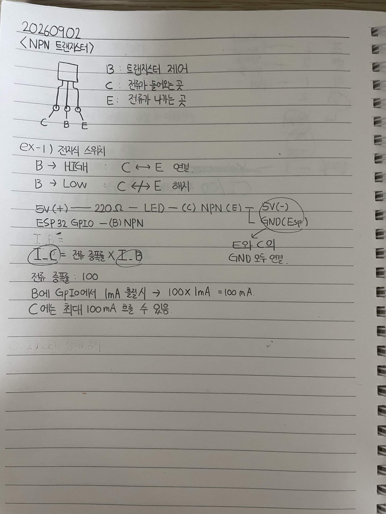

# 20260902

## NPN 트랜지스터

B : 트랜지스터 제어

C : 전류 들어오는 곳

E : 전류 나가는 곳

### EX-1) 전자식 스위치

B → HIGH : C ↔ E 연결

B → LOW : C ↔ E 해제

```text
5V(+) ── 220Ω ── LED ── (C) NPN (E) ── 5V(-)
ESP32 GPIO ── (B) NPN
```

5V(-)와 ESP32 GND는 모두 연결.

### 전류 증폭

```text
I_C = 전류 증폭 × I_B
```

전류 증폭 : 100

B에 GPIO해서 1mA 흘릴 시 → 100 × 1mA = 100mA.

C에는 최대 100mA 흐를 수 있음.


