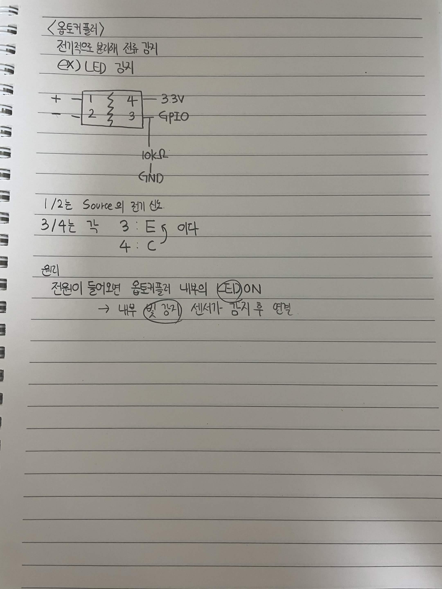

# 옵토커플러

전기적으로 분리해 전류 감지

EX) LED 공지

```text
+ ── 1                  4 ── 3.3V
- ── 2                  3 ── GPIO
```

1/2는 Source의 전기 신호.

3/4는 각각

3 : E

4 : C

원리

전원이 들어오면 옵토커플러 내부의 LED ON

→ 내부 빛 감지 센서가 감지 후 전달

```text
4 ── GPIO
 │
10kΩ
 │
GND
```


