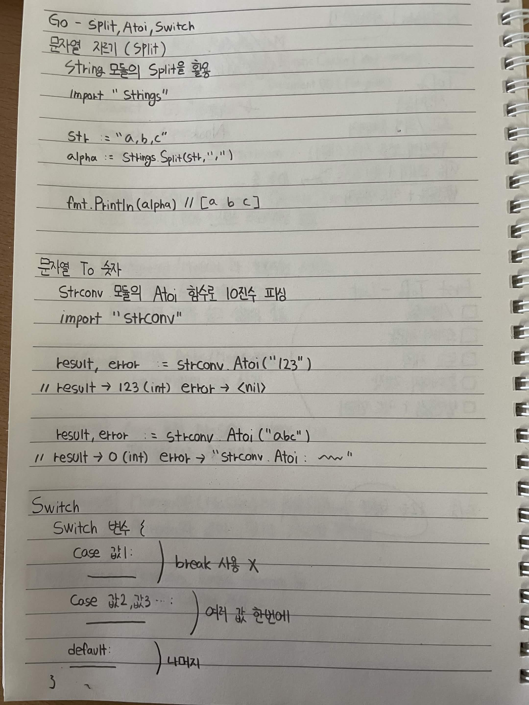

# Go - Split, Atoi, Switch

## 문자열 자르기 (Split)

String 모듈의 `Split`을 활용

```go
import "strings"

str := "a,b,c"
alpha := strings.Split(str, ",")

fmt.Println(alpha) // [a b c]
```

## 문자열 To 숫자

`strconv` 모듈의 `Atoi` 함수로 10진수 파싱

```go
import "strconv"

result, error := strconv.Atoi("123")
// result → 123 (int)
// error → <nil>

result, error := strconv.Atoi("abc")
// result → 0 (int)
// error → "strconv.Atoi: ..."
```

## Switch

```go
switch 변수 {
case 값1:
    // break 사용 X

case 값2, 값3:
    // 여러 값 한 번에

default:
    // 나머지
}
```

* `case 값1`: 해당 값과 일치하면 실행
* `case 값2, 값3`: 여러 값을 한 번에 처리
* `default`: 나머지 경우 처리
* Go의 `switch`에서는 기본적으로 `break`를 사용하지 않음

