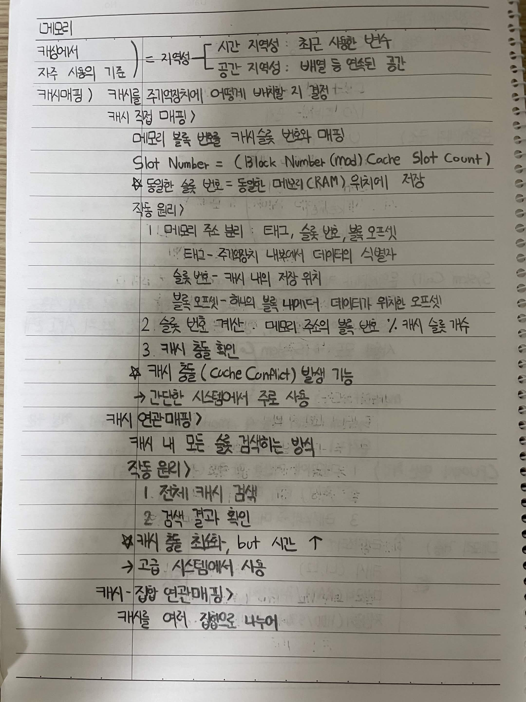
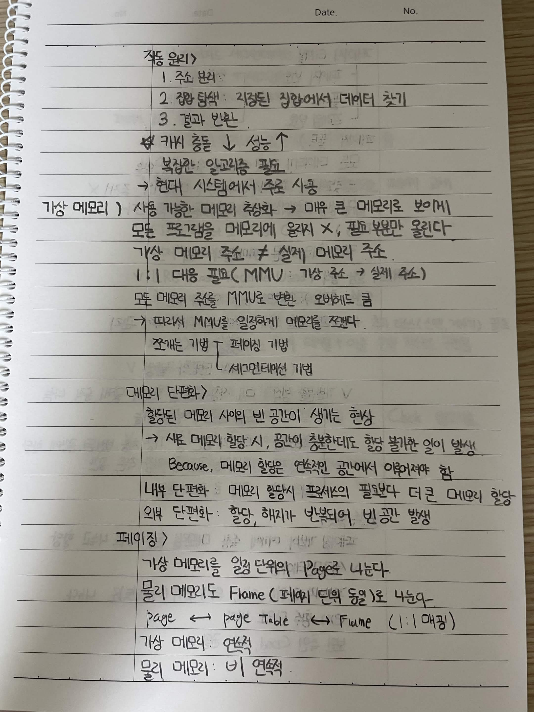
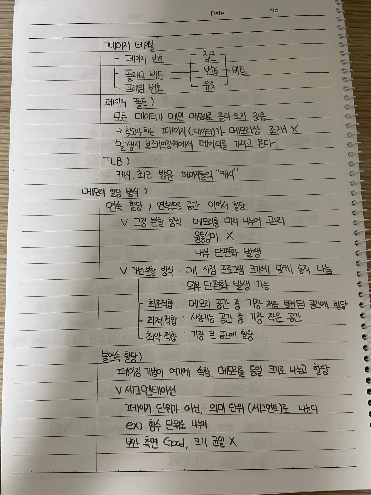
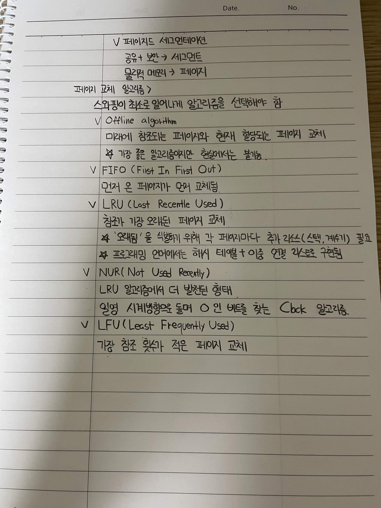

# 메모리

## 캐시

### 캐싱해서 자주 사용의 기준

= **지역성**

* **시간 지역성**: 최근 사용한 변수
* **공간 지역성**: 배열 등 연속된 공간

### 캐시 매핑

캐시를 주기억장치에 어떻게 배치할지 결정

#### 캐시 직접 매핑

메모리 블록 번호를 캐시 슬롯 번호와 매핑

```text
Slot Number = (Block Number mod Cache Slot Count)
```

* 동일한 슬롯 번호 = 동일한 메모리(CRAM) 위치에 저장

#### 작동 원리

1. **메모리 주소 분리**: 태그, 슬롯 번호, 블록 오프셋

   * 태그 → 주기억장치 내부에서 데이터의 식별자
   * 슬롯 번호 → 캐시 내 저장 위치
   * 블록 오프셋 → 하나의 블록 내에서 데이터가 위치한 오프셋
2. **슬롯 번호 계산**: 메모리 주소의 블록 번호 % 캐시 슬롯 개수
3. **캐시 충돌 확인**

> **캐시 충돌(Cache Conflict) 발생 가능**
>
> → 간단한 시스템에서 주로 사용

### 캐시 연관 매핑

캐시 내 모든 슬롯을 검색하는 방식

#### 작동 원리

1. 전체 캐시 검색
2. 검색 결과 확인

* 캐시 효율 ↓, but 시간 ↑
* 고급 시스템에서 사용

### 캐시 집합 연관 매핑

캐시를 여러 집합으로 나누어 사용

#### 작동 원리

1. 주소 분리
2. 집합 탐색: 지정된 집합에서 데이터 찾기
3. 결과 반환

* **캐시 충돌 ↓, 성능 ↑**
* 복잡한 알고리즘 필요
* 현대 시스템에서 주로 사용

---

# 가상 메모리

사용 가능한 메모리 추상화 → 매우 큰 메모리로 보이게

* 모든 프로그램을 메모리에 올리지 않고 **필요한 부분만 올림**
* 가상 메모리 주소 ≠ 실제 메모리 주소
* **MMU** 대응 필요 (가상 주소 → 실제 주소)
* 모든 메모리 주소를 MMU로 변환
* 따라서 MMU를 일정하게 메모리를 조절

### 주소 변환 기법

* 페이징 기법
* 세그멘테이션 기법

---

# 메모리 단편화

할당된 메모리 사이의 빈 공간이 생기는 현상

→ 새로 메모리 할당 시, 공간이 충분한데도 할당 불가능한 일이 발생

> 메모리 할당은 연속적인 공간에서 이루어져야 함

### 내부 단편화

메모리 할당 시 프로세스의 필요보다 더 큰 메모리 할당

### 외부 단편화

할당과 해지가 반복되어 빈 공간 발생

---

# 페이징

가상 메모리를 일정 단위인 **Page**로 나눔

물리 메모리도 **Frame**(페이지 단위와 동일)으로 나눔

```text
Page ←→ Page Table ←→ Frame
```

* 가상 메모리: 연속적
* 물리 메모리: 비연속적

## 페이지 테이블

| 구성 요소  | 역할           |
| ------ | ------------ |
| 페이지 번호 | 접근할 페이지      |
| 플래그 비트 | 접근 / 변경 / 비트 |
| 프레임 번호 | 실제 메모리 위치    |

### 페이지 폴트

모든 데이터가 메인 메모리에 올라와 있지 않음

→ 찾으려는 페이지(데이터)가 메모리상에 존재하지 않음

→ 발생 시 보조기억장치에서 데이터를 가져옴

### TLB

캐시처럼 최근 방문 페이지들의 정보를 저장

---

# 메모리 할당 방식

## 연속 할당

연속적으로 공간 이어서 할당

### 고정 분할 방식

메모리를 미리 나누어 관리

* 융통성이 X
* 내부 단편화 발생

### 가변 분할 방식

프로그램 크기에 맞게 동적 나눔

* 외부 단편화 발생 가능

#### 적합 방식

* **최초 적합**: 메모리 공간 중 가장 처음 발견된 공간에 할당
* **최적 적합**: 사용 가능한 공간 중 가장 작은 공간
* **최악 적합**: 가장 큰 공간에 할당

---

# 불연속 할당

페이징 기법의 예처럼 메모리를 동일 크기로 나누고 할당

## 세그멘테이션

페이징 단위가 아닌, 의미 단위(세그먼트)로 나눔

예:

* 함수 단위로 나누기

보안 측면 Good, 크기 균일 X

## 페이지 세그멘테이션

* 공유 + 보안 → 세그먼트
* 물리적 메모리 → 페이지

---

# 페이지 교체 알고리즘

스와핑이 최소로 일어나게 알고리즘을 선택해야 함

### Optimal Algorithm

미래에 참조되는 페이지와 현재 할당되는 페이지 교체

* 가장 좋은 알고리즘이지만 현실에서는 불가능

### FIFO (First In First Out)

먼저 온 페이지가 먼저 교체됨

### LRU (Least Recently Used)

참조가 가장 오래된 페이지 교체

* '오래됨'을 식별하기 위해 각 페이지마다 추가 리소스(스택, 카운터) 필요
* 프로그래밍 언어에서는 해시 테이블 + 이중 연결 리스트로 구현됨

### NUR (Not Used Recently)

LRU 알고리즘에서 더 발전된 형태

* 일정 시간 방향을 돌며 `0`인 비트를 찾는 Clock 알고리즘

### LFU (Least Frequently Used)

가장 참조 횟수가 적은 페이지 교체





