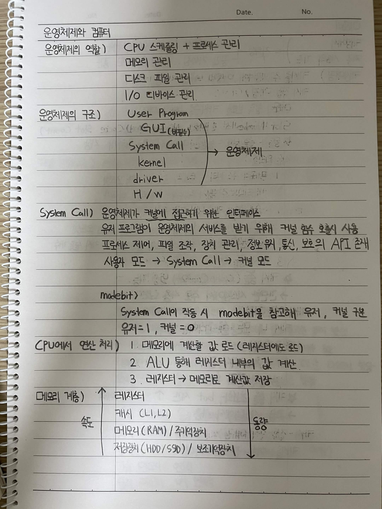

# 운영체제와 컴퓨터

## 운영체제의 역할

* CPU 스케줄링 + 프로세스 관리
* 메모리 관리
* 디스크, 파일 관리
* I/O 디바이스 관리

## 운영체제의 구조

```text
User Program
    ↓
GUI (비필수)
    ↓
System Call
    ↓
Kernel
    ↓
Driver
    ↓
H/W
```

`System Call`을 통해 사용자 프로그램이 운영체제에 접근

## System Call

운영체제가 커널에 접근하기 위한 인터페이스

사용자 프로그램이 운영체제의 서비스를 받기 위해 커널 함수를 호출하여 사용

* 프로세스 제어
* 파일 조작
* 장치 관리
* 정보 유지
* 통신
* 보호

```text
사용자 모드 → System Call → 커널 모드
```

### mode bit

System Call이 작동 시 `modebit`을 참고해 사용자/커널 권한을 구분

```text
사용자 = 1
커널 = 0
```

## CPU에서 연산 처리

1. 메모리에 계산할 값 로드 (레지스터에도 로드)
2. ALU를 통해 레지스터 내부의 값 계산
3. 레지스터 → 메모리로 계산값 저장

## 메모리 계층

```text
          ↑ 속도
          │
       레지스터
          │
       캐시 (L1, L2)
          │
    메모리 (RAM) / 주기억장치
          │
  저장장치 (HDD / SSD) / 보조기억장치
          │
          ↓ 용량
```

* 위로 갈수록 속도가 빠름
* 아래로 갈수록 용량이 큼


