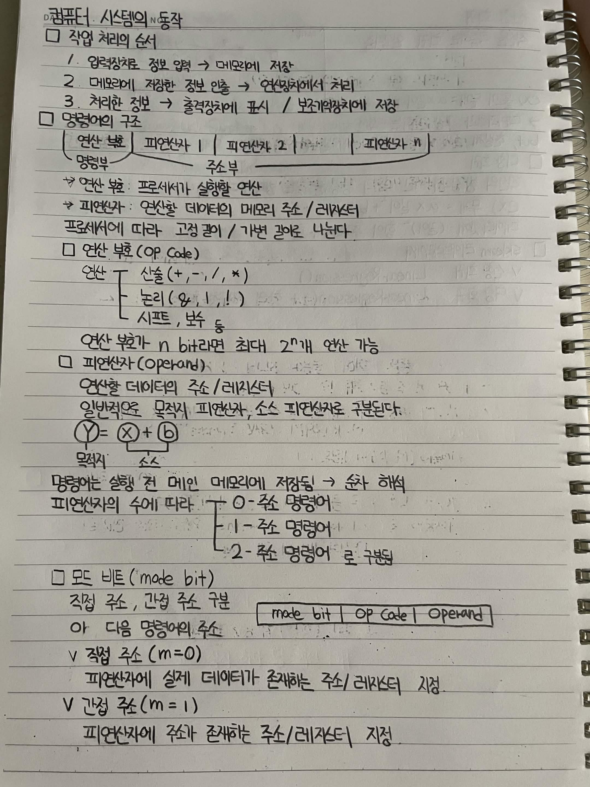
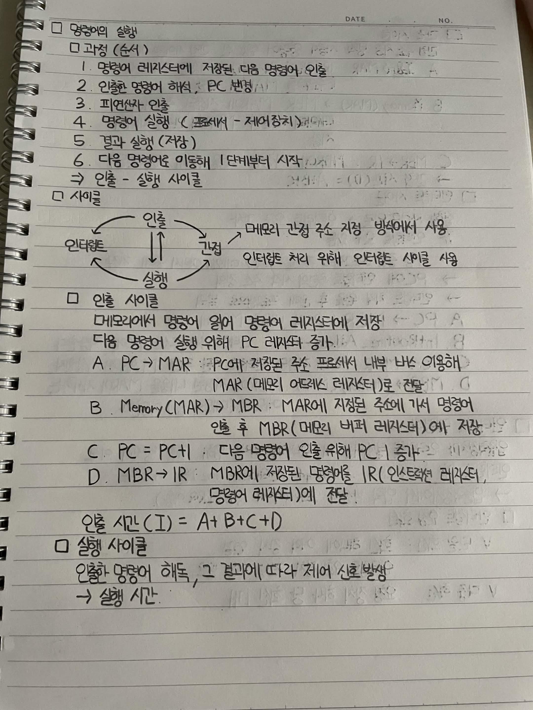
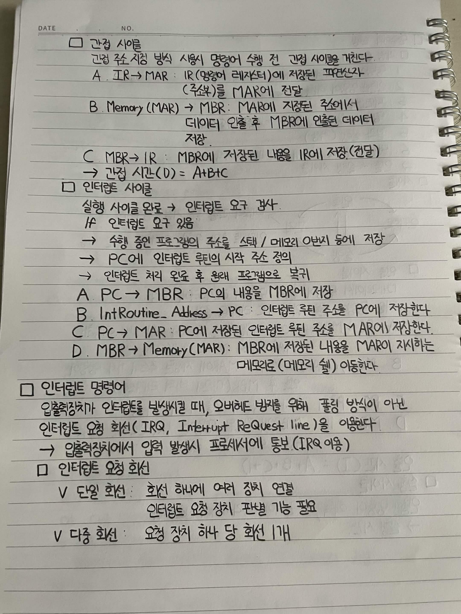

# 컴퓨터 시스템의 동작

## 작업 처리의 순서

1. 입력장치로 정보 입력 → 메모리에 저장
2. 메모리에 저장한 정보 인출 → 연산장치에서 처리
3. 처리한 정보 → 출력장치에 표시 / 보조기억장치에 저장

## 명령어의 구조

`연산부 | 피연산자 1 | 피연산자 2 | ... | 피연산자 n`

* **연산부**: 프로세서가 실행할 연산
* **피연산자**: 연산할 데이터의 메모리 주소 / 레지스터
* 프로세서에 따라 고정 길이 / 가변 길이로 나뉨

## 연산 부호 (OP Code)

* **산술**: `+`, `-`, `/`, `*`
* **논리**: `&`, `|`, `!`
* **시프트, 보수** 등

연산 부호가 n bit라면 최대 2ⁿ개의 연산 가능

## 피연산자 (Operand)

연산할 데이터의 주소 / 레지스터

일반적으로 **목적지 피연산자**, **소스 피연산자**로 구분한다.

`Y = X + b`

* `Y` → 목적지
* `X`, `b` → 소스

명령어는 실행 전 메인 메모리에 저장됨 → 순차 해석

피연산자의 수에 따라 **0-주소 명령어, 1-주소 명령어, 2-주소 명령어**로 구분됨

## 모드 비트 (Mode Bit)

직접 주소, 간접 주소를 구분

`Mode Bit | OP Code | Operand`

### 직접 주소 (m = 0)

피연산자에 실제 데이터가 존재하는 주소 / 레지스터 지정

### 간접 주소 (m = 1)

피연산자에 주소가 존재하는 주소 / 레지스터 지정

## 명령어의 실행

### 과정 (순서)

1. 명령어 레지스터에 저장된 다음 명령어 인출
2. 인출한 명령어 해석 → PC 변경
3. 피연산자 인출
4. 명령어 실행
5. 결과 실행 (저장)
6. 다음 명령어로 이동 → 1단계부터 시작

→ **인출 - 실행 사이클**

## 사이클

* **인출**
* **간접**
* **실행**

인출 → 간접 → 실행의 과정을 반복한다.

* 메모리 간접 주소 지정 방식에서 **간접 사이클** 사용
* 인터럽트 처리를 위해 **인터럽트 사이클** 사용

## 인출 사이클

메모리에서 명령어를 읽어 명령어 레지스터에 저장

다음 명령어 실행을 위해 PC 레지스터 증가

**A. PC → MAR**
PC에 저장된 주소를 프로세서 내부 버스를 이용해 MAR(메모리 주소 레지스터)로 전달

**B. Memory(MAR) → MBR**
MAR에 지정된 주소에 가서 명령어 인출 후 MBR(메모리 버퍼 레지스터)에 저장

**C. PC = PC + 1**
다음 명령어 인출을 위해 PC 증가

**D. MBR → IR**
MBR에 저장된 명령어를 IR(인스트럭션 레지스터, 명령어 레지스터)에 전달

인출 시간(I) = A + B + C + D

## 실행 사이클

인출한 명령어를 해독하고, 그 결과에 따라 제어 신호 발생

→ 실행 시간

## 간접 사이클

간접 주소 지정 방식 사용 시 명령어 수행 전 간접 사이클을 거친다.

**A. IR → MAR**
IR(명령어 레지스터)에 저장된 피연산자(주소부)를 MAR에 전달

**B. Memory(MAR) → MBR**
MAR에 지정된 주소에서 데이터를 인출한 후 MBR에 저장

**C. MBR → IR**
MBR에 저장된 내용을 IR에 저장(전달)

→ 간접 시간(I) = A + B + C

## 인터럽트 사이클

실행 사이클 완료 → 인터럽트 요구 검사

인터럽트 요구가 있으면:

→ 수행 중인 프로그램의 주소를 스택 / 메모리 0번지 등에 저장
→ PC에 인터럽트 루틴의 시작 주소 정의
→ 인터럽트 처리 완료 후 원래 프로그램으로 복귀

**A. PC → MBR**
PC의 내용을 MBR에 저장

**B. IntRoutine_Address → PC**
인터럽트 루틴 주소를 PC에 저장

**C. PC → MAR**
PC에 저장된 인터럽트 루틴 주소를 MAR에 저장

**D. MBR → Memory(MAR)**
MBR에 저장된 내용을 MAR이 지시하는 메모리로 이동한다.

## 인터럽트 명령어

입출력장치가 인터럽트를 발생시킬 때, 오버헤드 방지를 위해 폴링 방식이 아닌 **인터럽트 요청 회선(IRQ, Interrupt Request Line)**을 이용한다.

→ 입출력장치에서 입력 발생 시 프로세서에 통보(IRQ 이용)

## 인터럽트 요청 회선

* **단일 회선**: 회선 하나에 여러 장치 연결
  → 인터럽트 요청 장치 판별 가능 필요
* **다중 회선**: 요청 장치 하나당 회선 1개

