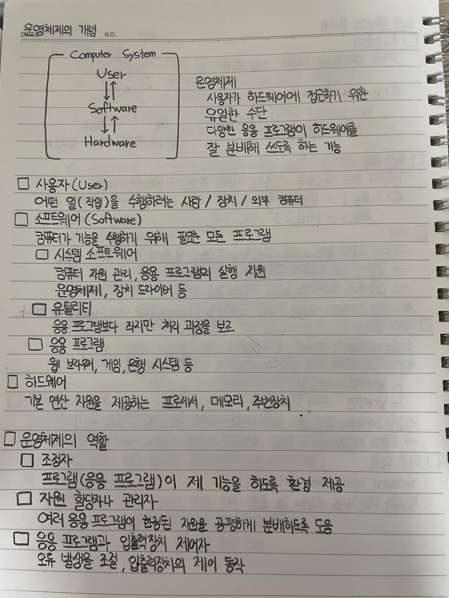
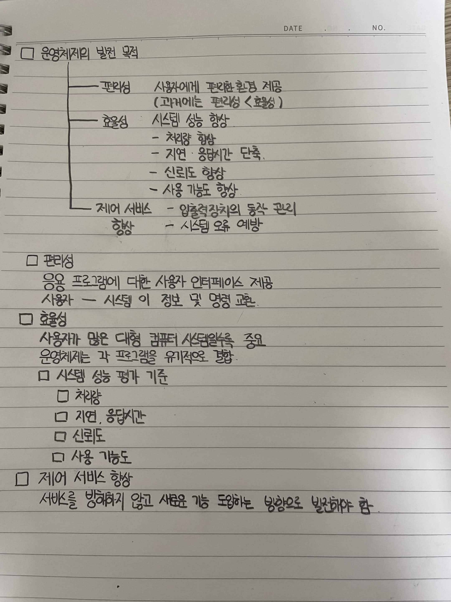

# 운영체제의 개념

## 운영체제

사용자가 하드웨어에 접근하기 위한 유일한 수단

다양한 응용 프로그램이 하드웨어를 잘 분배해 쓰도록 하는 기능

## 사용자(User)

어떤 일(작업)을 수행하려는 사람 / 장치 / 외부 컴퓨터

## 소프트웨어(Software)

컴퓨터가 기능을 실행하기 위해 필요한 모든 프로그램

### 시스템 소프트웨어

컴퓨터 자원 관리, 응용 프로그램의 실행 지원

운영체제, 장치 드라이버 등

### 유틸리티

응용 프로그램보다 작지만 처리 과정을 보조

### 응용 프로그램

웹 브라우저, 게임, 은행 시스템 등

## 하드웨어

기본 연산 자원을 제공하는 프로세서, 메모리, 주변장치

# 운영체제의 역할

## 조정자

프로그램(응용 프로그램)이 제 기능을 하도록 환경 제공

## 자원 할당자나 관리자

여러 응용 프로그램이 한정된 자원을 공평하게 분배하도록 도움

## 응용 프로그램과 입출력장치 제어자

오류 발생을 조절, 입출력장치의 제어 통합

# 운영체제의 발전 목적

## 편리성

사용자에게 편리한 환경 제공

과거에는 편리성보다 효율성을 중요하게 생각

## 효율성

시스템 성능 향상

처리량 향상

지연 및 응답시간 단축

신뢰도 향상

사용 가능도 향상

## 제어 서비스 향상

입출력장치의 동작 관리

시스템 오류 예방

# 편리성

응용 프로그램에 대한 사용자 인터페이스 제공

사용자와 시스템이 정보 및 명령 교환

# 효율성

사용자가 많은 대형 컴퓨터 시스템을 중요하게 생각

운영체제는 각 프로그램을 유기적으로 결합

## 시스템 성능 평가 기준

처리량

지연, 응답시간

신뢰도

사용 가능도

# 제어 서비스 향상

서비스를 방해하지 않고 새로운 기능을 도입하는 방향으로 발전해야 함

